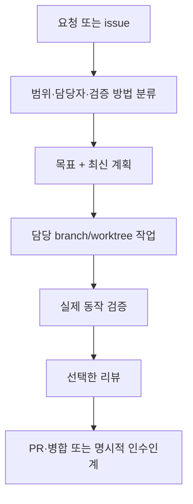

<p align="center">
  
</p>

<h1 align="center">Codexy</h1>

<p align="center">
  Codex 에이전트의 작업을 계획하고 나누어 맡기며, 구현, 검증과 리뷰를 연결하는 하네스
</p>

<p align="center">
  <a href="README.md">English</a>
</p>

<p align="center">
  <a href="LICENSE"></a>
  <a href="https://github.com/eunsoogi/codexy/commits/main"></a>
  <a href="https://github.com/eunsoogi/codexy/issues"></a>
</p>

Codexy는 Codex 에이전트의 작업을 계획하고 나누어 맡기며, 구현 결과를 실제로
검증하고 리뷰와 인수인계까지 연결하는 Codex 하네스입니다. 자세한 구조와 실행
계약은 연결된 `docs` 문서에서 확인할 수 있습니다.

## getcodexy로 설치하기

`getcodexy`는 컴포넌트 의존성을 계산하고 설치 목록과 수명주기를 관리합니다.

```sh
uv tool install getcodexy
uv tool update-shell
getcodexy install
```

tool bin 디렉터리를 `PATH`에 넣고 셸을 다시 연 뒤 사용하세요. 기본 설치는
`core`, `github`, `devtools`를 모두 포함합니다. 설치나 업데이트 뒤에는 새 Codex
세션을 열어 플러그인, skill, hook, agent, MCP 서버를 host에 노출하세요.

### 컴포넌트 선택

`github`와 `devtools`는 각각 `core`에 의존하며 필요한 의존성은 자동으로
포함됩니다.

| 컴포넌트   | 플러그인          | 추가되는 기능                                                                           |
| ---------- | ----------------- | --------------------------------------------------------------------------------------- |
| `core`     | `codexy`          | 오케스트레이션, 목표와 계획, 담당 worktree, 전문 에이전트, instruction hook, 검증, Wiki |
| `github`   | `codexy-github`   | GitHub workflow context, 좁은 제목 확인, local credential·filesystem·Git safety 확인    |
| `devtools` | `codexy-devtools` | 로컬 Codegraph와 LSP MCP 서버, wrapper, 설정, 개발 도구 지침                            |

| 설치 결과       | 명령                                |
| --------------- | ----------------------------------- |
| core만          | `getcodexy install core`            |
| core + GitHub   | `getcodexy install github`          |
| core + devtools | `getcodexy install devtools`        |
| 전체            | `getcodexy install github devtools` |

### 수명주기 명령

```sh
getcodexy status                       # 설치 목록 확인
getcodexy doctor                       # host 준비 상태와 컴포넌트 상태 확인
uv tool upgrade getcodexy              # CLI 자체 업데이트
getcodexy update                       # 설치된 모든 컴포넌트 업데이트
getcodexy update github                # GitHub 의존 범위 업데이트
getcodexy install github               # GitHub 추가
getcodexy remove github                # 의존 관계가 허용할 때 제거
getcodexy bootstrap                    # 전체 기본 구성으로 수렴
```

모든 명령은 `--json`을 지원합니다. 변경 작업은 journal과 receipt를 남기고,
실패하면 이전 선택을 복원합니다. 선택 규칙과 복구 동작은
[컴포넌트 설치 및 이전 계약](docs/getcodexy-component-installation.md)에
있습니다.

### 기존 monolith 이전

이전은 host가 중개하며, 신뢰할 수 있는 Codex 실행 파일을 절대 경로로 전달해야
합니다.

```sh
getcodexy --codex /absolute/path/to/codex migrate
getcodexy --codex /absolute/path/to/codex migrate core devtools
```

정확히 일치하고 수정되지 않은 versioned legacy tree와 서로 다른 split target만
이전할 수 있습니다. 나머지는 안전하게 거부되며, 중단된 이전은 기존 설정 또는
durable recovery journal을 보존합니다.

### 고급 사용: 플러그인 직접 설치

개발 또는 통제된 복구에서만 사용하고 `core`부터 설치하세요.

```sh
codex plugin marketplace add eunsoogi/codexy --ref v1.8.0
codex plugin add codexy@codexy
codex plugin add codexy-github@codexy
codex plugin add codexy-devtools@codexy
```

등록된 MCP 서버는 `uv`로 공통 부트스트랩을 실행하고, 부트스트랩은 `uvx`로 선택된
release를 실행합니다. Codex를 시작하는 host 환경의 `PATH`에서 `uv`와 `uvx`를
모두 찾을 수 있어야 세션에서 MCP 서버가 실행됩니다. `command -v uv`와
`command -v uvx`(PowerShell에서는 `Get-Command uv`, `Get-Command uvx`)로
확인하세요.

이 명령은 위의 release ref를 대상으로 합니다. 아직 공개되지 않았다면
[Releases](https://github.com/eunsoogi/codexy/releases)에서 공개된 tag를
선택하세요. 아래 기능 설명은 현재 source tree를 기준으로 하며, 변경 사항은
일치하는 공개 release로 설치하세요.

## Codexy가 하는 일

- **담당 범위와 오케스트레이션.** 작업을 분류하고 목표, 계획, issue 단위
  branch/worktree 담당자를 정해 인수인계와 context compaction 뒤에도 근거를
  보존합니다.
- **전문 에이전트와 검증.** 주장하는 표면에 맞춰 검증과 근거의 깊이를 정하고,
  세부 경계 규칙은 연결된 문서에서 확인합니다.
- **Instruction과 Wiki.** `AGENTS.md` 우선순위를 지키고,
  `init → ingest →
  compile → query → refresh` 흐름으로 출처와 freshness를
  보존하는 Wiki를 운영합니다.
- **GitHub 연동.** GitHub 컴포넌트는 workflow context와 독립적인 local safety
  확인을 제공합니다. 일반 issue·PR·review·merge의 권한과 정책은 host, connector,
  GitHub 및 저장소 소유자가 정합니다. 설치만으로 일반 작업을 차단하거나 PR 본문,
  review 횟수, 고정 승인 문구를 요구하지 않습니다.
- **개발 도구와 복구.** Codegraph와 LSP로 필요한 범위를 탐색하고, 세 컴포넌트의
  설치·업데이트·복구 과정에 receipt와 rollback 근거를 남깁니다.

## Skill 목록

설치되는 배포본에는 다음 skill이 포함됩니다. 각 행에서 정확한 이름과 짧은 목적,
컴포넌트, 실제 `SKILL.md` 원문 링크를 확인할 수 있습니다.

| Skill                                                                                       | 목적                                                                           | 컴포넌트   |
| ------------------------------------------------------------------------------------------- | ------------------------------------------------------------------------------ | ---------- |
| [agents-md-authoring](plugins/codexy/skills/agents-md-authoring/SKILL.md)                   | `AGENTS.md` 지침 파일을 만들고, 검토하고, 옮기고, 범위를 정합니다.             | `core`     |
| [blind-read](plugins/codexy/skills/blind-read/SKILL.md)                                     | 한 가지 artifact와 행동을 새 독자의 관점에서 해석합니다.                       | `core`     |
| [decision-rationale](plugins/codexy/skills/decision-rationale/SKILL.md)                     | 이미 선택한 결정의 이유와 근거를 살핍니다.                                     | `core`     |
| [dreaming](plugins/codexy/skills/dreaming/SKILL.md)                                         | context compaction 뒤에 유지할 사실과 진행 중인 일을 복원합니다.               | `core`     |
| [engineering](plugins/codexy/skills/engineering/SKILL.md)                                   | 하나의 결과를 진단하고, 구체화하고, 구현하고, 리팩터링하고, 검증합니다.        | `core`     |
| [frame-alternatives](plugins/codexy/skills/frame-alternatives/SKILL.md)                     | 주어진 제약 안에서 신뢰할 수 있는 대안을 제시합니다.                           | `core`     |
| [goal-lifecycle](plugins/codexy/skills/goal-lifecycle/SKILL.md)                             | 실제 goal 상태를 사용하고 오래된 blocked 실행 기록을 복구합니다.               | `core`     |
| [orchestration](plugins/codexy/skills/orchestration/SKILL.md)                               | 담당, 실행, 근거, 인수인계, review 경로를 분류하고 조정합니다.                 | `core`     |
| [plan-stress-test](plugins/codexy/skills/plan-stress-test/SKILL.md)                         | 명시적으로 선택한 하나의 중요한 plan을 점검하며 자동 리뷰 단계가 아닙니다.     | `core`     |
| [planning](plugins/codexy/skills/planning/SKILL.md)                                         | 실행 권한을 가져오지 않고 실행 가능한 project plan을 만들고 갱신합니다.        | `core`     |
| [project-brief](plugins/codexy/skills/project-brief/SKILL.md)                               | 기록된 현재 project 상태를 읽기 전용 brief로 정리합니다.                       | `core`     |
| [proof-driven-completion](plugins/codexy/skills/proof-driven-completion/SKILL.md)           | 모든 완료 주장을 현재의 권위 있는 근거와 연결합니다.                           | `core`     |
| [prune-artifact-claims](plugins/codexy/skills/prune-artifact-claims/SKILL.md)               | 하나의 artifact를 하나의 기준 source에 맞춰 오래된 주장을 정리합니다.          | `core`     |
| [realtime-voice-orchestration](plugins/codexy/skills/realtime-voice-orchestration/SKILL.md) | 명시적으로 요청한 realtime voice 작업을 담당자에게 연결합니다.                 | `core`     |
| [wiki](plugins/codexy/skills/wiki/SKILL.md)                                                 | 하나의 범위 있는 source 기반 topic knowledge base를 만들고 운영합니다.         | `core`     |
| [git-workflow](plugins/codexy-github/skills/git-workflow/SKILL.md)                          | issue, branch, worktree, PR, review, merge, main 동기화 workflow를 관리합니다. | `github`   |
| [codegraph](plugins/codexy-devtools/skills/codegraph/SKILL.md)                              | 저장소 구조와 dependency edge를 정해진 범위에서 탐색합니다.                    | `devtools` |
| [lsp](plugins/codexy-devtools/skills/lsp/SKILL.md)                                          | 언어 인식 symbol, reference, definition, diagnostic을 요청합니다.              | `devtools` |

`plugin-marketplace-prep`, `release-engineering`, `skill-evaluation` 같은 저장소
전용 유지보수 skill은 `.agents/skills`에 남아 있으며 설치 기능에 포함되지
않습니다.

### Planning, orchestration, engineering의 구분

계획 내용을 만들거나 갱신하려면 `$planning`을 사용하세요. 예를 들면 다음과
같습니다.

```text
$planning 이 issue를 각 단계의 담당자, 근거, 종료 조건이 있는 세 단계 plan으로 나눠줘.
```

`planning`은 계획 내용을 맡고, `orchestration`은 담당자와 인수인계를 포함한 실행
조정을 맡습니다. `engineering`은 개별 구현과 그 검증을 맡습니다. planning
요청만으로 작업이 배정되거나 실행 권한이 생기지는 않습니다. `plan-stress-test`는
명시적으로 선택해야 하는 자문 점검이며 자동 리뷰 단계가 아닙니다.

### 오케스트레이션 한눈에 보기



### 검증 workflow

Codexy는 목표와 중요한 위험에서 시작해 작업 범위를 issue 하나에 맞추고,
요구사항에 따른 행동 검증을 유지합니다. test-first 순서는 경계별로 따로 정하고,
검증 깊이는 주장하는 결과에 맞춥니다. 필요한 경우 비례적인 review를 추가하고
근거가 충분하면 멈춥니다. 자세한 workflow와 현재 runtime 계약은 이 소개 뒤쪽의
아키텍처 안내서에서 확인할 수 있습니다.

### 모델 역할과 추론 수준

Codexy는 작업 담당자와 Codexy에 포함된 전문 에이전트를 구분합니다. 아래는
프로젝트의 역할 설정이며, 설치만으로 호스트의 기본 모델이 바뀌거나 다른 저장소의
GitHub 정책에 동의한 것으로 해석되지 않습니다.

| 역할                       | 모델           | 추론 수준 | 담당 범위                                                                                                                            |
| -------------------------- | -------------- | --------- | ------------------------------------------------------------------------------------------------------------------------------------ |
| Orchestrator / parent      | `gpt-6-astra`  | `medium`  | Worker 작업을 배정·추적하고 전체 작업 목표를 맡아 이탈을 교정하며 보고를 검증하고 결과를 인수합니다.                                 |
| Watcher / `codexy-watcher` | `gpt-5.6-luna` | `max`     | 할당된 Worker를 native subagent로 읽기 전용 관찰하고 core Watcher MCP로 중요한 사건을 보고하며, 지시·수정·교체·인수는 하지 않습니다. |
| Worker / ordinary child    | `gpt-5.6-luna` | `max`     | 별도 app task에서 자신의 branch/worktree로 이슈를 구현·검증하고, Watcher 경로가 있으면 지정된 Watcher를 통해 보고합니다.             |

보고 흐름은 Orchestrator가 native Watcher를 호출하고 Worker에게 작업을
배정·교정하면, 해당 경로에서 Worker가 host가 지원하는 task-message 경로로 source
Worker task와 issue/PR 대응을 보존한 채 정확히 지정된 Watcher task에 일반 보고를
보냅니다. Luna/max Watcher는 변경 없는 보고를 억제하고 중요한 사건을
`watcher_report`로 중계하며, Astra/medium Orchestrator는 `watcher_wait`로
받습니다. Orchestrator는 보고를 판단하고 Worker를 지시하며 교정과 결과 인수
권한을 유지합니다. 부모는 Worker에게 구현 지시를 직접 보냅니다. 확인된 메시지
경로 부재나 구체적인 긴급 상황일 때만 한 번 표시된 parent fallback을 허용하며,
일상적인 중복 보고를 되살리지는 않습니다. 목표 전환 receipt는 계속 parent에 직접
보냅니다.

목표도 분리됩니다. Orchestrator는 전체 작업 목표, Watcher는 유한한 관찰 배정,
Worker는 유한한 실행 목표를 맡습니다. Watcher는 전체 목표를 소유하거나 옮기지
않습니다. 이 설정은 Codexy에 포함된 구성이지 이미 실행 중인 host가 실제로 사용한
모델의 증거는 아닙니다. `low`, `medium`, `high`, `xhigh`, `max`는 추론
수준입니다.

### 패키지 전문 에이전트

패키지 catalog는 각 전문 에이전트에 고유한 모델과 추론 수준을 지정하며, 선택형
`codexy-github` 플러그인이 Weaver를 제공합니다.

| 컴포넌트 | 전문 에이전트         | 모델            | 추론 수준 | 담당 범위                                  |
| -------- | --------------------- | --------------- | --------- | ------------------------------------------ |
| core     | `codexy-architect`    | `gpt-6-astra`   | `high`    | 아키텍처와 통합 경계                       |
| core     | `codexy-sentinel`     | `gpt-6-astra`   | `xhigh`   | 엄격한 리뷰                                |
| core     | `codexy-warden`       | `gpt-6-astra`   | `xhigh`   | 안전·권한 경계                             |
| core     | `codexy-inspector`    | `gpt-5.6-sol`   | `medium`  | 표준 리뷰                                  |
| core     | `codexy-auditor`      | `gpt-5.6-terra` | `medium`  | 인수 기준과 실제 동작 검증                 |
| core     | `codexy-cartographer` | `gpt-5.6-luna`  | `low`     | 저장소 탐색                                |
| core     | `codexy-shipwright`   | `gpt-5.6-terra` | `high`    | 릴리스와 패키징                            |
| core     | `codexy-watcher`      | `gpt-5.6-luna`  | `max`     | core Watcher MCP를 통한 native Worker 관찰 |
| github   | `codexy-weaver`       | `gpt-5.6-terra` | `medium`  | GitHub 통합; GitHub 컴포넌트 제공          |

### 실시간 음성 모드

`realtime-voice-orchestration` skill은 일반 `$orchestration`과 함께 사용하는
음성 전용 routing·표현 계층입니다. 담당자, child 조정, 근거, thread 상태의 최종
권한은 일반 오케스트레이션에 있습니다. 확인되지 않은 상태를 추측하지 않고, 원시
log와 불투명한 식별자를 말하지 않으며, PR·merge·release 단계도 구분합니다.

### 상세 문서와 공개 경계

패키지 agent·skill·MCP/LSP runtime의 실제 목록과 LSP batch, hook timing, doctor
상태는 [아키텍처 안내서](docs/architecture.md)에서 확인할 수 있습니다. GitHub의
일반 작업 경계와 선택 가능한 진단은
[GitHub product boundary](docs/plugin-product-boundary.md), 설치 receipt와
오류·복구 규칙은 [설치 계약](docs/getcodexy-component-installation.md)에
있습니다.

## 지원 플랫폼과 검증 범위

| 플랫폼 또는 host surface      | 지원 및 검증 범위                                                                                                                               |
| ----------------------------- | ----------------------------------------------------------------------------------------------------------------------------------------------- |
| macOS ARM64 (`darwin-arm64`)  | 세 플러그인의 패키지 대상이며 CI가 build·install과 lifecycle을 검증합니다.                                                                      |
| Linux x86_64 (`linux-x86_64`) | 세 플러그인의 패키지 대상이며 Ubuntu CI가 lifecycle과 migration을 검증합니다.                                                                   |
| Windows x86_64                | CI가 component CLI, transaction lifecycle, recovery, GitHub activation을 실행합니다. 자동 legacy 탐색과 devtools runtime까지 주장하지 않습니다. |
| LSP host prerequisite         | 등록한 language server가 host에 설치되어 실행 가능해야 합니다.                                                                                  |

## 라이선스

Codexy는 [MIT 라이선스](LICENSE)로 제공됩니다.
