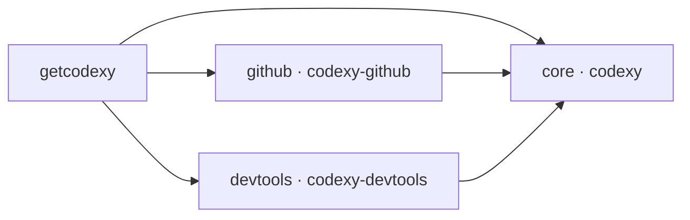
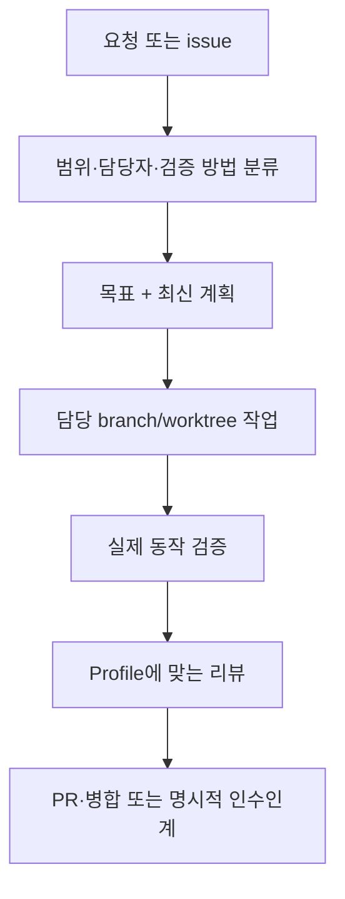

<p align="center">
  
</p>

<h1 align="center">Codexy</h1>

<p align="center">
  담당 범위가 분명한 작업, 전문 에이전트, 검증 중심 완료를 위한 Codex 하네스
</p>

<p align="center">
  <a href="README.md">English</a>
</p>

<p align="center">
  <a href="LICENSE"></a>
  <a href="https://github.com/eunsoogi/codexy/commits/main"></a>
  <a href="https://github.com/eunsoogi/codexy/issues"></a>
</p>

Codexy는 큰 저장소 요청을 담당자가 분명한 구현, 실제 동작 검증, 범위가 제한된
리뷰, 안전한 완료까지 이어 주는 Codex 하네스입니다. 하나 이상의 Codex 에이전트가
계획, 구현, 검증, 리뷰, 인수인계를 조율하도록 돕고, 컴포넌트별 설치와 지속적인
증거 수집으로 작업 과정을 추적할 수 있게 합니다. 상세 아키텍처와 실행 계약은
연결된 `docs` 문서에서 다룹니다.

## getcodexy로 설치하기

Codexy를 설치하고 관리할 때는 `getcodexy`를 사용하세요. 컴포넌트 의존성을
계산하고, 설치된 목록을 기록하며, 설치 수명주기를 트랜잭션으로 처리합니다.

### 기본 설치

Codexy의 전체 제품을 설치합니다.

```sh
uv tool install getcodexy
# uv의 tool bin 디렉터리를 PATH에 추가한 뒤 셸을 재시작하거나 다시 로드합니다.
uv tool update-shell
getcodexy install
```

기본 구성은 `core`, `github`, `devtools`를 모두 설치합니다. 설치나 업데이트
뒤에는 새 Codex 세션을 열어 새 플러그인, skill, hook, agent, MCP 서버가 host에
노출되도록 하세요.

### 컴포넌트 선택

Codexy는 서로 협력하는 세 플러그인으로 제공됩니다. `github`와 `devtools`는 각각
`core`에 의존하며 서로에게는 의존하지 않습니다. 필요한 의존성은 자동으로
포함됩니다.

| 컴포넌트   | 플러그인          | 추가되는 기능                                                                                |
| ---------- | ----------------- | -------------------------------------------------------------------------------------------- |
| `core`     | `codexy`          | 오케스트레이션, 목표와 계획, worktree 담당 범위, 전문 에이전트, instruction hook, 검증, Wiki |
| `github`   | `codexy-github`   | branch, PR, CI, 리뷰, 릴리스, GitHub 안전 hook을 잇는 issue-to-merge 절차                    |
| `devtools` | `codexy-devtools` | 로컬 Codegraph와 LSP MCP 서버, wrapper, 설정, 개발 도구 지침                                 |

| 설치 결과                | 명령                                |
| ------------------------ | ----------------------------------- |
| core만                   | `getcodexy install core`            |
| core + GitHub            | `getcodexy install github`          |
| core + devtools          | `getcodexy install devtools`        |
| core + GitHub + devtools | `getcodexy install github devtools` |



### 수명주기 명령

첫 번째 명령으로 `getcodexy` CLI를 영구 설치하고, 아래 예시는 해당 실행 파일로
전체 수명주기를 관리합니다.

```sh
getcodexy status                       # 설치된 컴포넌트 목록 확인
getcodexy doctor                       # host 준비 상태와 컴포넌트 상태 확인
uv tool upgrade getcodexy              # 설치된 CLI 자체 업데이트
getcodexy update                       # 설치된 모든 컴포넌트 업데이트
getcodexy update github                # GitHub 의존 범위 업데이트
getcodexy install github               # 기존 구성에 GitHub 추가
getcodexy remove github                # 의존 관계가 허용할 때 GitHub 제거
getcodexy bootstrap                    # 전체 기본 구성으로 수렴
```

모든 명령은 `--json`을 지원합니다. 변경 작업은 durable journal과 receipt를
남깁니다. 실패하면 이전 선택을 정확히 복원하며, 의존성이 남은 컴포넌트 제거,
혼합 버전, 알 수 없는 컴포넌트, 일관되지 않은 설치 목록은 변경 전에 거부합니다.
선택 규칙, receipt, 오류 코드, 복구 동작은
[컴포넌트 설치 및 이전 계약](docs/getcodexy-component-installation.md)에
정리되어 있습니다.

### 기존 monolith 이전

이전은 host가 중개합니다. 신뢰할 수 있는 Codex host가 자신의 실행 파일을 절대
경로로 전달해야 합니다.

```sh
getcodexy --codex /absolute/path/to/codex migrate
getcodexy --codex /absolute/path/to/codex migrate core devtools
```

정확히 일치하고 수정되지 않은 버전 고정 legacy tree와, 서로 다른 split target만
이전할 수 있습니다. 수정됐거나 link된 tree, 읽을 수 없거나 출처가 불분명한
tree는 안전하게 거부합니다. 중단되거나 실패한 이전은 기존 설정을 transaction으로
복원하거나 다음 신뢰할 수 있는 재시도를 위한 durable recovery journal을
보존합니다.

### 고급 사용: 플러그인 직접 설치

Marketplace 직접 설치는 개발 또는 통제된 복구를 위한 고급 경로입니다. 개별
컴포넌트를 직접 설치해야 할 때 사용하고 `core`부터 설치하세요.

```sh
codex plugin marketplace add eunsoogi/codexy --ref v1.6.2
codex plugin add codexy@codexy
codex plugin add codexy-github@codexy
codex plugin add codexy-devtools@codexy
```

## Codexy가 하는 일

Codexy는 계획, 구현, 검증, 리뷰, 인수인계까지 이어지는 저장소 작업이나 여러
에이전트의 역할 경계가 필요한 작업에 유용합니다. 현재 제공하는 기능은 다음과
같습니다.

- **오케스트레이션과 담당 범위.** 작업을 분류하고 유한한 목표와 최신 계획을
  만들며, issue 단위 branch/worktree마다 담당자를 한 명만 둡니다. 인수인계와
  context compaction 뒤에도 검증 근거를 보존합니다.
- **Profile과 전문 에이전트.** 아래에 정리한 패키지 전문 에이전트로 범위가
  분명한 작업을 배정합니다. 표준 리뷰는 Inspector, 엄격 리뷰는 Sentinel이
  담당합니다.
- **Instruction hook.** 적용 범위와 우선순위가 분명한 `AGENTS.md`를 작성하고
  다시 읽어 확인합니다. Core는 task-thread 전달 metadata를 검사하고, GitHub
  컴포넌트는 GitHub 작업·저장소 명령·파괴적 shell 작업의 admission을 검사합니다.
- **검증과 엔지니어링.** 실행 가능한 엔지니어링 경계에만 TDD를 적용하고 실제
  변경 surface에 맞는 validator와 실제 동작 검사를 실행하며, 완료와 리뷰 근거를
  현재 파일 상태 또는 commit에 묶습니다.
- **LLM Wiki.** `init → ingest → compile → query → refresh` 흐름으로 범위가
  제한된 topic root를 관리합니다. immutable raw source, 인용, provenance,
  freshness 검사, 명시적인 knowledge gap을 유지합니다.
- **GitHub 절차.** Issue intake부터 branch와 worktree, PR, CI, 리뷰 대응, 승인된
  squash merge, 릴리스, 병합 뒤 `main` 동기화까지 조정합니다.
- **개발 도구.** Codegraph로 범위가 제한된 dependency neighborhood를 살피고,
  맞는 language server가 설치돼 있으면 LSP 탐색, symbol, definition, reference,
  diagnostic을 사용합니다.
- **패키징과 복구.** 세 플러그인의 버전을 맞추고 공개 경계를 검증하며, 설치와
  릴리스 작업의 receipt와 rollback 근거를 보존합니다.

### 오케스트레이션 한눈에 보기

오케스트레이션은 첫 요청부터 최종 인수인계까지 담당 범위, 검증, 리뷰를 확인할 수
있는 흐름으로 연결합니다.



### 실시간 음성 모드

`realtime-voice-orchestration` skill은 일반 `$orchestration`과 함께 사용하는
음성 전용 routing·표현 계층입니다. 담당자, dispatch, child 조정, 근거, thread
상태의 최종 권한은 계속 일반 오케스트레이션에 있습니다. 지원하는 흐름은 다음과
같습니다.

`voice input -> owning orchestrator/parent -> parent-managed child coordination -> parent result -> voice summary`

“지금 잘 되고 있어?”나 “현재 뭐가 진행 중이야?” 같은 질문은 대화 속 표현과 사용
가능한 현재 화면 context를 authoritative한 활성 project 상태와 대조해
해석합니다. 분명한 parent가 있으면 parent로 보내고, 관련 standalone 활성
thread가 정확히 하나면 그 thread로 직접 보냅니다. 여러 project가 가능하면 짧은
확인을 한 번만 요청하고, 담당자가 없으면 대화로 답하거나 새 task 시작을
제안합니다. 음성 계층은 parent의 child를 직접 지휘하지 않습니다.

| 확인한 context                                         | 음성 routing                     | 음성 계층의 경계                  |
| ------------------------------------------------------ | -------------------------------- | --------------------------------- |
| 분명한 owning orchestrator/parent가 있음               | 그 parent로만 보냄               | child 조정은 parent가 담당        |
| 관련 standalone 활성 project thread가 정확히 하나 있음 | 그 thread로 직접 보냄            | orchestrator를 임의로 만들지 않음 |
| 가능한 project workflow가 둘 이상임                    | 짧은 확인을 한 번 요청           | 추측으로 고르지 않음              |
| 활성 work owner가 없음                                 | 대화로 답하거나 task 시작을 제안 | 무관한 thread로 보내지 않음       |

음성 상태 안내는 dispatch가 authoritative하게 확인된 뒤에만 시작하며,
bounded/event-driven 방식으로 상태를 확인합니다. 진행 중, 성공, 실패, 취소,
blocked를 구분하고, 사용자가 끼어들면 현재 음성 안내만 양보하면서 중복
dispatch나 durable work 취소를 만들지 않습니다. 원시 log와 불투명한 식별자는
말하지 않으며, local verification·PR/merge·public release 단계도 분리합니다.
현재 화면이나 native thread 도구를 사용할 수 없으면 그 한계를 밝히고 추측하거나
host를 고치지 않습니다. #611은 외부 host dependency로 남습니다.

### 지원하는 서브에이전트

Core 플러그인은 일곱 가지 전문 에이전트를 포함합니다. `codexy-github`를 설치하면
GitHub 작업과 병합 조정을 담당하는 Weaver가 추가됩니다.

| 컴포넌트 | 지원 서브에이전트     | 잘 맞는 작업                                                                   |
| -------- | --------------------- | ------------------------------------------------------------------------------ |
| core     | `codexy-architect`    | 플러그인 경계, schema, 오케스트레이션 계약, MCP/LSP 연결, 확장 지점            |
| core     | `codexy-cartographer` | 읽기 전용 저장소 탐색, Codegraph 조사, 파일 맵, 패턴 매핑                      |
| core     | `codexy-auditor`      | CLI, 설정, GitHub, 브라우저, 앱, 플러그인 surface의 실제 동작 검증             |
| core     | `codexy-shipwright`   | 버전 변경, 릴리스 PR, manifest 동기화, marketplace 준비, tag, rollback 계획    |
| core     | `codexy-inspector`    | 현재 diff의 범위가 제한된 표준 Profile 리뷰, 정확성, 회귀, 범위 확인           |
| core     | `codexy-sentinel`     | 인수인계, PR 준비, 병합, 최종 완료 전의 엄격한 Profile 리뷰                    |
| core     | `codexy-warden`       | workflow, shell 명령, credential, 원격 MCP endpoint, 신뢰할 수 없는 입력, 권한 |
| github   | `codexy-weaver`       | 병렬 lane 조정, main 업데이트, 충돌 탐지, 병합 순서 준비                       |

패키지에 포함된 전체 목록, 컴포넌트 경계, 에이전트 목록, skill 계약, MCP/LSP
runtime 경계는 [아키텍처 안내서](docs/architecture.md)에서 확인할 수 있습니다.
저장소 유지관리와 릴리스 skill은 이 저장소에서만 사용되며, Codexy를 설치해도 이
프로젝트의 유지관리 정책이 다른 저장소에 자동으로 추가되지는 않습니다.

## 공개 스킬 카탈로그

설치된 각 skill의 최종 정의는 패키지의 `SKILL.md`에 있습니다. 이 카탈로그는 현재
컴포넌트 구성을 처음 사용하는 사람에게 안내하기 위한 문서이며 별도 registry가
아닙니다.

### Core

| 호출                           | 설명                                                                                                                                                                                                                 |
| ------------------------------ | -------------------------------------------------------------------------------------------------------------------------------------------------------------------------------------------------------------------- |
| `agents-md-authoring`          | 저장소 root 지침, 하위 디렉터리 규칙, 지침 우선순위, 범위 경계, 검증과 readback 기대 사항을 포함해 AGENTS.md 지침 파일을 만들거나 수정·리뷰·이동할 때 반드시 사용합니다.                                             |
| `prune-artifact-claims`        | 코드가 아닌 하나의 정확한 artifact를 하나의 정확한 기준 source에 맞춰 갱신하면서 충돌하거나 대체됐거나 중복된 주장만 삭제할 때 사용합니다.                                                                           |
| `blind-read`                   | 새로운 독자가 외부 context를 판단·편집·재구성하지 않고, 지정된 audience와 action을 위해 하나의 artifact를 해석해야 할 때 사용합니다.                                                                                 |
| `decision-rationale`           | 사용자가 이미 선택한 option의 명시된 이유, 근거의 뒷받침 여부, 근거 없는 가정, 결정을 다시 열 조건을 결정 자체를 바꾸지 않고 살펴볼 때 사용합니다.                                                                   |
| `dreaming`                     | context compaction 뒤 활성 Codex task를 재개하거나, 상속된 summary가 오래됐거나 과도해 보이거나, 해결한 작업이 계속 활성 상태로 나타나거나, durable fact·active fix·stale detail을 구분해야 할 때 반드시 사용합니다. |
| `engineering`                  | 하나의 atomic engineering workflow에서 진단, 명세, domain modeling, TDD, refactoring, QA를 수행할 때 반드시 사용합니다.                                                                                              |
| `frame-alternatives`           | 사용자가 제안한 하나의 방향에 대해 제공된 authoritative constraint를 만족하는 대안을 제시해 달라고 명시적으로 요청할 때 사용합니다.                                                                                  |
| `goal-lifecycle`               | 실제 goal tool(`create_goal`, `get_goal`, `update_goal`)을 사용하거나 goal state가 제어하는 task를 재개할 때 사용하며, goal tooling을 사용하지 않는 작업에는 불러오지 않습니다.                                      |
| `orchestration`                | workflow·surface·risk를 분류하거나 ownership, goal, agent, thread, worktree, review, compaction, handoff를 조정할 때 사용하며, 해당 authority만 불러옵니다.                                                          |
| `plan-stress-test`             | 사용자가 구현 전에 acceptance criteria로 하나의 중요한 plan을 stress-test하는 데 명시적으로 동의했을 때 사용합니다.                                                                                                  |
| `project-brief`                | 진행 중인 task로 돌아온 사람이 ownership, status, plan, action을 바꾸지 않고 기록된 현재 상태의 read-only brief가 필요할 때 사용합니다.                                                                              |
| `proof-driven-completion`      | 코드, 문서, workflow, UI, plugin, marketplace, release 작업의 완료 주장, 인수인계, PR 생성·병합, issue 종료, 성공 보고, goal 완료 전에 반드시 사용합니다.                                                            |
| `realtime-voice-orchestration` | authoritative Codex project owner에게 task나 status 요청을 전달하고 orchestration을 넘겨받지 않은 채 검증된 진행 상황을 요약해야 하는 realtime voice interaction을 사용자가 명시적으로 요청할 때 사용합니다.         |
| `wiki`                         | 자연어로 하나의 bounded source-backed topic knowledge base를 만들거나 운영할 때 사용하며, 일반 repository search·README summary·planning·session memory·무관한 research에는 사용하지 않습니다.                       |

### GitHub

| 호출           | 설명                                                                                                                                                        |
| -------------- | ----------------------------------------------------------------------------------------------------------------------------------------------------------- |
| `git-workflow` | 공개 Codexy orchestration 계약에 따라 어느 repository에서든 GitHub issue, branch, worktree, PR, review, merge, CI, release workflow를 수행할 때 사용합니다. |

### Devtools

| 호출              | 설명                                                                                               |
| ----------------- | -------------------------------------------------------------------------------------------------- |
| `developer-tools` | Codexy Devtools가 설치되어 있고 로컬 Codegraph 탐색이나 LSP diagnostic이 필요한 작업에 사용합니다. |

이 저장소에는 Codexy maintainer를 위한 `plugin-marketplace-prep`과
`release-engineering`도 `.agents/skills/` 아래에 있습니다. 둘은 저장소에서만
사용하는 maintenance skill이며 패키지 플러그인과 함께 설치되지 않습니다.

## 지원 플랫폼과 검증 범위

| 플랫폼 또는 host surface           | 지원 및 검증 범위                                                                                                                                                            |
| ---------------------------------- | ---------------------------------------------------------------------------------------------------------------------------------------------------------------------------- |
| macOS ARM64 (`darwin-arm64`)       | `codexy`, `codexy-github`, `codexy-devtools` 패키지 대상입니다. CI가 패키지 build·install, lifecycle 명령, legacy-to-split candidate 이전을 검증합니다.                      |
| Linux x86_64 (`linux-x86_64`)      | 세 플러그인 모두의 패키지 대상입니다. Ubuntu CI가 패키지 build/install, lifecycle 명령, legacy-to-split candidate 이전을 검증합니다.                                         |
| Windows x86_64 (native CI surface) | CI가 컴포넌트 CLI, transaction lifecycle, recovery, GitHub activation 계약을 실행합니다. 자동 legacy tree 탐색이나 패키지 devtools runtime까지 지원한다고 주장하지 않습니다. |
| LSP host prerequisite              | 등록한 각 language server가 host에 설치되어 실행 가능해야 합니다.                                                                                                            |

## 라이선스

Codexy는 [MIT 라이선스](LICENSE)로 제공됩니다.
