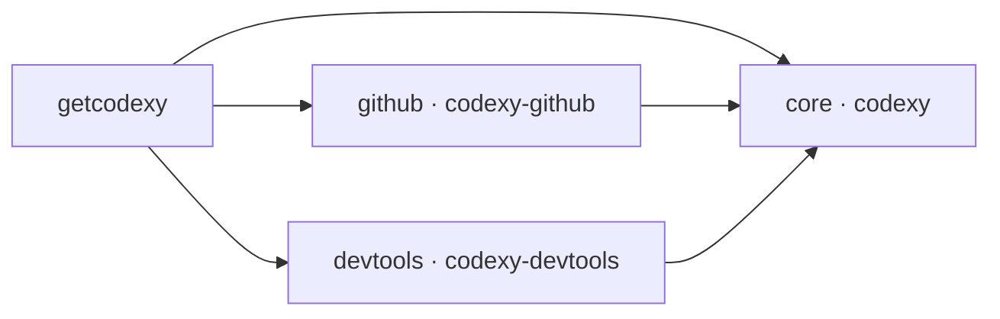
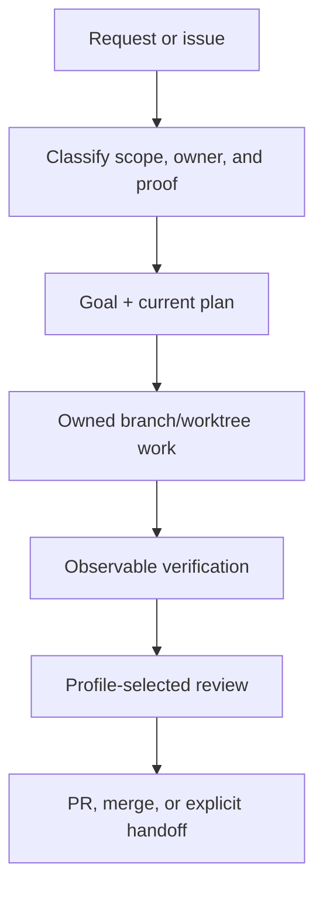

<p align="center">
  
</p>

<h1 align="center">Codexy</h1>

<p align="center">
  A component-aware Codex harness for owned work, specialist help, and proof-driven completion.
</p>

<p align="center">
  <a href="README.ko.md">Korean</a>
</p>

<p align="center">
  <a href="LICENSE"></a>
  <a href="https://github.com/eunsoogi/codexy/commits/main"></a>
  <a href="https://github.com/eunsoogi/codexy/issues"></a>
</p>

Codexy gives Codex a disciplined path from a broad repository request to an
owned implementation, observable verification, bounded review, and a safe
finish. Use it to coordinate planning, implementation, verification, review, and
handoff across one or more Codex agents, with component-aware installation and
durable evidence. Detailed architecture and executable contracts live in the
linked `docs` guides.

## Install with getcodexy

`getcodexy` is the recommended way to install and maintain Codexy. It resolves
the component dependency graph, records the installed inventory, and exposes
transactional lifecycle commands.

### Default installation

Install the complete Codexy product:

```sh
uv tool install getcodexy
# Add uv's tool bin directory to PATH, then restart or reload your shell.
uv tool update-shell
getcodexy install
```

The default selection installs `core`, `github`, and `devtools`. Open a fresh
Codex session after installation or update so the host can expose new plugins,
skills, hooks, agents, and MCP servers.

### Select components

Codexy is delivered as three cooperating plugins. `github` and `devtools` each
depend on `core`; they do not depend on one another. Dependencies are added
automatically.

| Component  | Plugin            | What it adds                                                                                         |
| ---------- | ----------------- | ---------------------------------------------------------------------------------------------------- |
| `core`     | `codexy`          | Orchestration, goals and plans, worktree ownership, specialists, instruction hooks, proof, and Wiki. |
| `github`   | `codexy-github`   | Issue-to-merge workflow for branches, PRs, CI, reviews, release work, and GitHub safety hooks.       |
| `devtools` | `codexy-devtools` | Local Codegraph and LSP MCP servers, wrappers, configuration, and developer-tool guidance.           |

| Desired result           | Command                             |
| ------------------------ | ----------------------------------- |
| core only                | `getcodexy install core`            |
| core + GitHub            | `getcodexy install github`          |
| core + devtools          | `getcodexy install devtools`        |
| core + GitHub + devtools | `getcodexy install github devtools` |



### Lifecycle commands

The first command installs the `getcodexy` CLI persistently; the examples below
then use that executable for the complete lifecycle.

```sh
getcodexy status                       # read the installed-component inventory
getcodexy doctor                       # check host readiness and component health
uv tool upgrade getcodexy              # update the installed CLI itself
getcodexy update                       # update every installed component
getcodexy update github                # update one installed dependency closure
getcodexy install github               # add GitHub to an existing selection
getcodexy remove github                # remove GitHub when dependencies allow it
getcodexy bootstrap                    # converge on the complete default selection
```

All commands accept `--json`. Mutations use a durable journal and receipt. A
failed mutation restores the exact previous selection; dependency-protected
removals, mixed versions, unknown components, and inconsistent installed
inventories are rejected before mutation. See the
[component installation and
migration contract](docs/getcodexy-component-installation.md) for selection
rules, receipts, errors, and recovery behavior.

### Migrate a legacy monolith

Migration is host-mediated. The trusted Codex host must supply its executable as
an absolute path:

```sh
getcodexy --codex /absolute/path/to/codex migrate
getcodexy --codex /absolute/path/to/codex migrate core devtools
```

Only an exact, unmodified, versioned legacy tree and a distinct split target are
eligible. Modified, linked, unreadable, unknown, or ambiguous trees fail closed.
Interrupted or failed migrations recover the prior configuration transactionally
or preserve a durable recovery journal for the next trusted retry.

### Advanced: direct plugin installation

Direct marketplace installation is for development or controlled recovery. Use
it when you need to install individual components directly, and install `core`
first.

```sh
codex plugin marketplace add eunsoogi/codexy --ref v1.6.2
codex plugin add codexy@codexy
codex plugin add codexy-github@codexy
codex plugin add codexy-devtools@codexy
```

## What Codexy does

Codexy is useful when repository work spans planning, implementation,
verification, review, and handoff, or when several agents need clear boundaries.
Its shipped capabilities are:

- **Orchestration and ownership.** Classify the task, establish finite goals and
  current plans, assign one owner per issue-sized branch/worktree, and preserve
  durable evidence through handoffs and context compaction.
- **Profiles and specialists.** Route bounded work to the packaged specialists
  below. Standard review uses Inspector, while strict review uses Sentinel.
- **Instruction hooks.** Author scoped `AGENTS.md` files with explicit
  precedence and readback. Core validates task-thread delivery metadata; the
  GitHub component adds admission checks for GitHub operations, repository
  commands, and destructive shell actions.
- **Proof and engineering.** Apply TDD only to executable engineering
  boundaries, run source-aligned validators and real-surface checks, and bind
  completion and review evidence to the current file state or commit.
- **LLM Wiki.** Maintain a bounded topic root through
  `init → ingest → compile → query → refresh`, with immutable raw sources,
  citations, provenance, freshness checks, and explicit knowledge gaps.
- **GitHub workflow.** Coordinate issue intake, branches and worktrees, PRs, CI,
  review feedback, authorized squash merge, release work, and post-merge `main`
  synchronization.
- **Developer tools.** Explore bounded dependency neighborhoods with Codegraph
  and use LSP discovery, symbols, definitions, references, and diagnostics when
  a matching language server is installed.
- **Packaging and recovery.** Keep the three plugins version-aligned, validate
  their public boundaries, and retain receipts and rollback evidence for
  installation and release operations.

### Orchestration at a glance

The orchestration path keeps ownership, verification, and review visible from
the first request to the final handoff:



### Realtime voice mode

The `realtime-voice-orchestration` skill adds a voice-specific routing and
presentation layer alongside normal `$orchestration`. Normal orchestration
remains the canonical authority for ownership, dispatch, child coordination,
evidence, and thread state. The supported flow is:

`voice input -> owning orchestrator/parent -> parent-managed child coordination -> parent result -> voice summary`

For questions such as “is the work going well?” or “what is happening now?”, the
skill resolves conversational references and available current-screen context
against authoritative active project state. A clear parent receives the request;
exactly one relevant standalone active thread can receive it directly; multiple
plausible projects get one concise clarification; and no active owner gets a
conversational response or an offer to start a task. The voice layer never
steers a parent's children directly.

| Observed context                                             | Voice route                                       | Boundary                            |
| ------------------------------------------------------------ | ------------------------------------------------- | ----------------------------------- |
| A clear owning orchestrator/parent exists                    | Route to that parent only                         | The parent coordinates its children |
| Exactly one relevant standalone active project thread exists | Route directly to that thread                     | Do not invent an orchestrator       |
| More than one project workflow remains plausible             | Ask one concise clarification                     | Do not choose by guess              |
| No active work owner exists                                  | Respond conversationally or offer to start a task | Do not route to unrelated threads   |

Voice updates wait for confirmed authoritative dispatch, use
bounded/event-driven monitoring, and distinguish in-progress work from terminal
success, failure, cancellation, or blocked states. An interruption yields the
spoken response without duplicating dispatch or cancelling durable work.
Summaries omit raw logs and opaque identifiers, and keep local verification,
PR/merge, and public release phases separate. If current-screen or native
thread-tool capability is unavailable, the limit is stated rather than guessed
or patched locally; #611 remains an external host dependency.

### Supported subagents

The core plugin packages seven specialists. Installing `codexy-github` adds
Weaver for GitHub-specific lane and merge coordination.

| Component | Supported subagent    | Best for                                                                                        |
| --------- | --------------------- | ----------------------------------------------------------------------------------------------- |
| core      | `codexy-architect`    | Plugin boundaries, schemas, orchestration contracts, MCP/LSP wiring, and extension points.      |
| core      | `codexy-cartographer` | Read-only repository discovery, Codegraph exploration, file maps, and pattern mapping.          |
| core      | `codexy-auditor`      | Observable verification across CLI, config, GitHub, browser, app, and plugin surfaces.          |
| core      | `codexy-shipwright`   | Version bumps, release PRs, manifest sync, marketplace readiness, tags, and rollback planning.  |
| core      | `codexy-inspector`    | One bounded standard-profile review of the current diff, correctness, regressions, and scope.   |
| core      | `codexy-sentinel`     | Strict-profile review before handoff, PR readiness, merge, or final completion.                 |
| core      | `codexy-warden`       | Workflows, shell commands, credentials, remote MCP endpoints, untrusted input, and permissions. |
| github    | `codexy-weaver`       | Reconciling parallel lanes, updating main, detecting conflicts, and preparing merge sequencing. |

The detailed packaged inventory, component boundaries, agent catalog, skill
contracts, and MCP/LSP runtime boundaries are in the
[architecture guide](docs/architecture.md). Repository-maintenance and release
skills remain repository-only; installing Codexy does not silently add this
project's maintainer policy to another repository.

## Public skill catalog

Each installed skill remains defined by its packaged `SKILL.md`; this catalog is
a first-user guide to the current component inventory, not a separate registry.

### Core

| Invocation                     | Description                                                                                                                                                                                                                                             |
| ------------------------------ | ------------------------------------------------------------------------------------------------------------------------------------------------------------------------------------------------------------------------------------------------------- |
| `agents-md-authoring`          | MUST use when creating, updating, reviewing, or relocating AGENTS.md instruction files, including repository root guidance, nested directory rules, instruction precedence, scope boundaries, and verification/readback expectations.                   |
| `prune-artifact-claims`        | Use when one exact non-code artifact must be refreshed against one exact governing source by deleting only conflicting, superseded, or duplicated claims.                                                                                               |
| `blind-read`                   | Use when a fresh reader must interpret one artifact for one named audience and action without judging, editing, or reconstructing outside context.                                                                                                      |
| `decision-rationale`           | Use when a user has already chosen one option and asks to inspect its stated reason, evidence support, unsupported assumption, and reopen condition without changing the decision.                                                                      |
| `dreaming`                     | MUST use when an active Codex task resumes after context compaction, inherited summaries feel stale or overfull, resolved work keeps reappearing as active, or an agent MUST separate durable facts, active fixes, and stale details before continuing. |
| `engineering`                  | MUST use for diagnosis, specification, domain modeling, test-driven development, refactoring, or quality assurance in one atomic engineering workflow.                                                                                                  |
| `frame-alternatives`           | Use when a user explicitly asks to surface credible alternatives for one proposed direction against supplied authoritative constraints.                                                                                                                 |
| `goal-lifecycle`               | Use when real goal tools (`create_goal`, `get_goal`, or `update_goal`) are used, or when resuming a task controlled by a goal state; MUST NOT load it for work that does not use goal tooling.                                                          |
| `orchestration`                | Use when classifying workflow, surface, and risk or coordinating ownership, goals, agents, threads, worktrees, reviews, compaction, and handoff; load only applicable authorities.                                                                      |
| `plan-stress-test`             | Use when the user explicitly opts in to stress-test one important plan with acceptance criteria before implementation.                                                                                                                                  |
| `project-brief`                | Use when a person returns to an ongoing task and needs a read-only brief of recorded current state without changing ownership, status, plans, or actions.                                                                                               |
| `proof-driven-completion`      | MUST use before claiming work is done, handing off, opening or merging a PR, closing an issue, reporting success, or completing a goal for code, docs, workflow, UI, plugin, marketplace, or release tasks.                                             |
| `realtime-voice-orchestration` | Use when a user explicitly requests a realtime voice interaction that must route a task or status request to an authoritative Codex project owner and summarize verified progress without taking over orchestration.                                    |
| `wiki`                         | Use for natural-language requests to build or operate one bounded, source-backed topic knowledge base; not for ordinary repository search, README summary, planning, session memory, or unrelated research.                                             |

### GitHub

| Invocation     | Description                                                                                                                                                    |
| -------------- | -------------------------------------------------------------------------------------------------------------------------------------------------------------- |
| `git-workflow` | Use for GitHub issue, branch, worktree, pull request, review, merge, CI, and release workflow in any repository with the public Codexy orchestration contract. |

### Devtools

| Invocation        | Description                                                                                              |
| ----------------- | -------------------------------------------------------------------------------------------------------- |
| `developer-tools` | Use when Codexy Devtools is installed and the task needs local Codegraph exploration or LSP diagnostics. |

The repository also carries `plugin-marketplace-prep` and `release-engineering`
under `.agents/skills/` for Codexy maintainers. These are repository-only
maintenance skills and are not installed with the packaged plugins.

## Supported platforms and proof boundary

| Platform or host surface           | What is supported and verified                                                                                                                                                          |
| ---------------------------------- | --------------------------------------------------------------------------------------------------------------------------------------------------------------------------------------- |
| macOS ARM64 (`darwin-arm64`)       | Packaged target for `codexy`, `codexy-github`, and `codexy-devtools`; CI builds and installs the package, exercises lifecycle commands, and proves legacy-to-split candidate migration. |
| Linux x86_64 (`linux-x86_64`)      | Packaged target for all three plugins; Ubuntu CI covers package build/install, lifecycle commands, and legacy-to-split candidate migration.                                             |
| Windows x86_64 (native CI surface) | CI exercises the component CLI, transaction lifecycle, recovery, and GitHub activation contracts. It does not claim automatic legacy-tree traversal or the packaged devtools runtime.   |
| LSP host prerequisite              | Each registered language server must also be installed and executable on the host.                                                                                                      |

## License

Codexy is available under the [MIT License](LICENSE).
