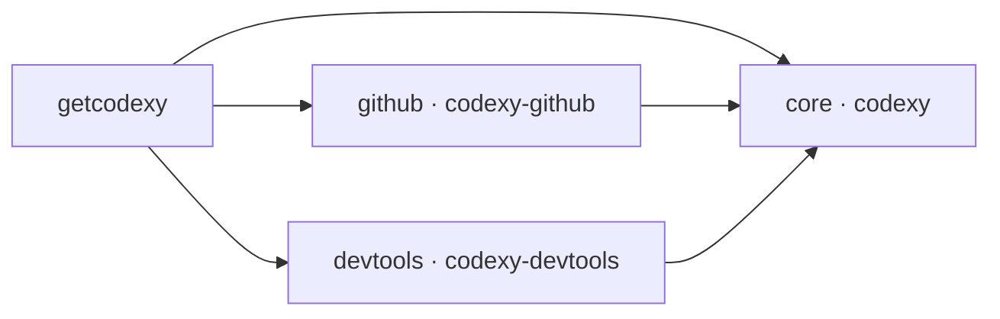
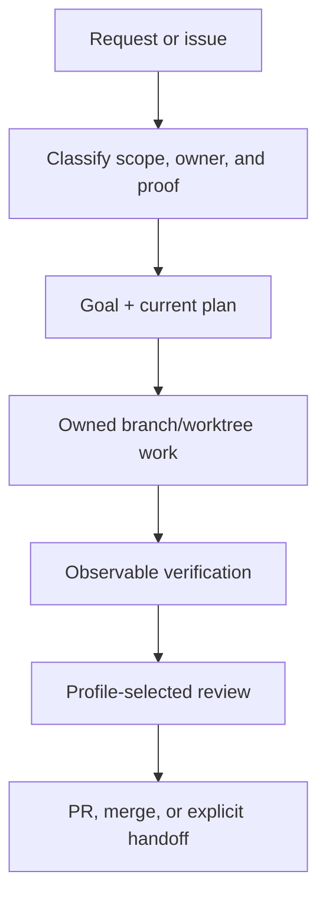

<p align="center">
  
</p>

<h1 align="center">Codexy</h1>

<p align="center">
  A component-aware Codex harness for owned work, specialist help, and proof-driven completion.
</p>

<p align="center">
  <a href="README.ko.md">Korean</a>
</p>

<p align="center">
  <a href="LICENSE"></a>
  <a href="https://github.com/eunsoogi/codexy/commits/main"></a>
  <a href="https://github.com/eunsoogi/codexy/issues"></a>
</p>

Codexy gives Codex a disciplined path from a broad repository request to an
owned implementation, observable verification, bounded review, and a safe
finish. This README is both a first-reader explanation and a complete,
scannable public overview; detailed architecture and executable contracts live
in the linked `docs` guides.

## Install with getcodexy

`getcodexy` is the recommended way to install and maintain Codexy. It resolves
the component dependency graph, records the installed inventory, and exposes
transactional lifecycle commands.

### Default installation

Install the complete Codexy product:

```sh
uvx --from getcodexy getcodexy install
```

The default selection installs `core`, `github`, and `devtools`. Open a fresh
Codex session after installation or update so the host can expose new plugins,
skills, hooks, agents, and MCP servers.

### Select components

Codexy is delivered as three cooperating plugins. `github` and `devtools` each
depend on `core`; they do not depend on one another. Dependencies are added
automatically.

| Component  | Plugin            | What it adds                                                                                         |
| ---------- | ----------------- | ---------------------------------------------------------------------------------------------------- |
| `core`     | `codexy`          | Orchestration, goals and plans, worktree ownership, specialists, instruction hooks, proof, and Wiki. |
| `github`   | `codexy-github`   | Issue-to-merge workflow for branches, PRs, CI, reviews, release work, and GitHub safety hooks.       |
| `devtools` | `codexy-devtools` | Local Codegraph and LSP MCP servers, wrappers, configuration, and developer-tool guidance.           |

| Desired result           | Command                             |
| ------------------------ | ----------------------------------- |
| core only                | `getcodexy install core`            |
| core + GitHub            | `getcodexy install github`          |
| core + devtools          | `getcodexy install devtools`        |
| core + GitHub + devtools | `getcodexy install github devtools` |



### Lifecycle commands

```sh
getcodexy status                       # read the installed-component inventory
getcodexy doctor                       # check host readiness and component health
getcodexy update                       # update every installed component
getcodexy update github                # update one installed dependency closure
getcodexy install github               # add GitHub to an existing selection
getcodexy remove github                # remove GitHub when dependencies allow it
getcodexy bootstrap                    # converge on the complete default selection
```

All commands accept `--json`. Mutations use a durable journal and receipt. A
failed mutation restores the exact previous selection; dependency-protected
removals, mixed versions, unknown components, and inconsistent installed
inventories are rejected before mutation. See the [component installation and
migration contract](docs/getcodexy-component-installation.md) for selection
rules, receipts, errors, and recovery behavior.

### Migrate a legacy monolith

Migration is host-mediated. The trusted Codex host must supply its executable as
an absolute path:

```sh
getcodexy --codex /absolute/path/to/codex migrate
getcodexy --codex /absolute/path/to/codex migrate core devtools
```

Only an exact, unmodified, versioned legacy tree and a distinct split target are
eligible. Modified, linked, unreadable, unknown, or ambiguous trees fail closed.
Interrupted or failed migrations recover the prior configuration transactionally
or preserve a durable recovery journal for the next trusted retry.

### Advanced: direct plugin installation

Direct marketplace installation is for development or controlled recovery. Use
an immutable released tag, install `core` first, and never treat an omitted
`--ref` or mutable `main` as a normal deployment source.

```sh
# Run only after v1.4.0 exists as an immutable release tag.
codex plugin marketplace add eunsoogi/codexy --ref v1.4.0
codex plugin add codexy@codexy
codex plugin add codexy-github@codexy
codex plugin add codexy-devtools@codexy
```

## What Codexy does

Codexy is useful when repository work spans planning, implementation,
verification, review, and handoff, or when several agents need clear
boundaries. Its shipped capabilities are:

- **Orchestration and ownership.** Classify the task, establish finite goals
  and current plans, assign one owner per issue-sized branch/worktree, and
  preserve durable evidence through handoffs and context compaction.
- **Profiles and specialists.** Route bounded work to the packaged specialists
  below. Standard review uses Inspector, while strict review uses Sentinel.
- **Instruction hooks.** Author scoped `AGENTS.md` files with explicit
  precedence and readback. Core validates task-thread delivery metadata; the
  GitHub component adds admission checks for GitHub operations, repository
  commands, and destructive shell actions.
- **Proof and engineering.** Apply TDD only to executable engineering
  boundaries, run source-aligned validators and real-surface checks, and bind
  completion and review evidence to the current file state or commit.
- **LLM Wiki.** Maintain a bounded topic root through
  `init → ingest → compile → query → refresh`, with immutable raw sources,
  citations, provenance, freshness checks, and explicit knowledge gaps.
- **GitHub workflow.** Coordinate issue intake, branches and worktrees, PRs,
  CI, review feedback, authorized squash merge, release work, and post-merge
  `main` synchronization.
- **Developer tools.** Explore bounded dependency neighborhoods with Codegraph
  and use LSP discovery, symbols, definitions, references, and diagnostics when
  a matching language server is installed.
- **Packaging and recovery.** Keep the three plugins version-aligned, validate
  their public boundaries, and retain receipts and rollback evidence for
  installation and release operations.

### Orchestration at a glance

The orchestration path keeps ownership, verification, and review visible from
the first request to the final handoff:



### Supported subagents

The core plugin packages seven specialists. Installing `codexy-github` adds
Weaver for GitHub-specific lane and merge coordination.

| Component | Supported subagent | Best for |
| --- | --- | --- |
| core | `codexy-architect` | Plugin boundaries, schemas, orchestration contracts, MCP/LSP wiring, and extension points. |
| core | `codexy-cartographer` | Read-only repository discovery, Codegraph exploration, file maps, and pattern mapping. |
| core | `codexy-auditor` | Observable verification across CLI, config, GitHub, browser, app, and plugin surfaces. |
| core | `codexy-shipwright` | Version bumps, release PRs, manifest sync, marketplace readiness, tags, and rollback planning. |
| core | `codexy-inspector` | One bounded standard-profile review of the current diff, correctness, regressions, and scope. |
| core | `codexy-sentinel` | Strict-profile review before handoff, PR readiness, merge, or final completion. |
| core | `codexy-warden` | Workflows, shell commands, credentials, remote MCP endpoints, untrusted input, and permissions. |
| github | `codexy-weaver` | Reconciling parallel lanes, updating main, detecting conflicts, and preparing merge sequencing. |

The detailed packaged inventory, component boundaries, agent catalog, skill
contracts, and MCP/LSP runtime boundaries are in the [architecture
guide](docs/architecture.md). Repository-maintenance and release skills remain
repository-only; installing Codexy does not silently add this project's
maintainer policy to another repository.

## Supported platforms and proof boundary

| Platform or host surface | What is supported and verified |
| --- | --- |
| macOS ARM64 (`darwin-arm64`) | Packaged target for `codexy`, `codexy-github`, and `codexy-devtools`; CI builds and installs the package, exercises lifecycle commands, and proves legacy-to-split candidate migration. |
| Linux x86_64 (`linux-x86_64`) | Packaged target for all three plugins; Ubuntu CI covers package build/install, lifecycle commands, and legacy-to-split candidate migration. |
| Windows x86_64 (native CI surface) | CI exercises the component CLI, transaction lifecycle, recovery, and GitHub activation contracts. It does not claim automatic legacy-tree traversal or the packaged devtools runtime. |
| LSP host prerequisite | Each registered language server must also be installed and executable on the host. |

## License

Codexy is available under the [MIT License](LICENSE).
