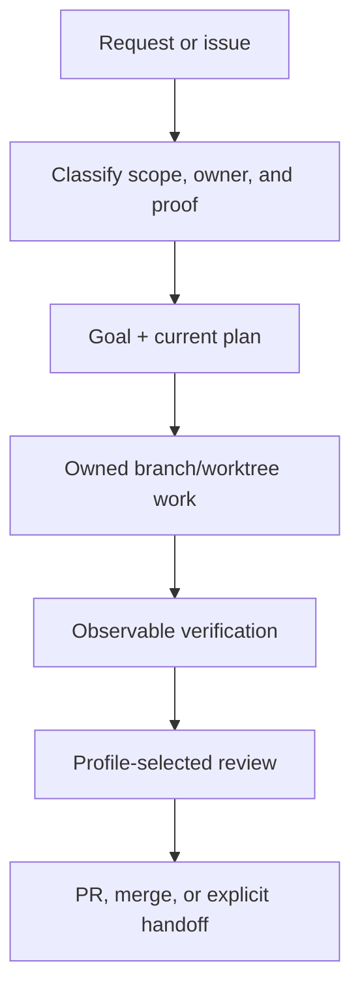

<p align="center">
  
</p>

<h1 align="center">Codexy</h1>

<p align="center">
  A component-aware Codex harness for owned work, specialist help, and proof-driven completion.
</p>

<p align="center">
  <a href="README.ko.md">Korean</a>
</p>

<p align="center">
  <a href="LICENSE"></a>
  <a href="https://github.com/eunsoogi/codexy/commits/main"></a>
  <a href="https://github.com/eunsoogi/codexy/issues"></a>
</p>

Codexy gives Codex a disciplined path from a broad repository request to an
owned implementation, observable verification, bounded review, and a safe
finish. Use it to coordinate planning, implementation, verification, review, and
handoff across one or more Codex agents. Detailed architecture and executable
contracts live in the linked guides.

## Install with getcodexy

`getcodexy` is the recommended way to install and maintain Codexy. It resolves
component dependencies, records the installed inventory, and exposes
transactional lifecycle commands.

### Default installation

Install the complete Codexy product:

```sh
uv tool install getcodexy
uv tool update-shell
getcodexy install
```

Add uv's tool bin directory to `PATH`, then restart or reload your shell if
needed. The default selection installs `core`, `github`, and `devtools`; open a
fresh Codex session after installation or update so the host can expose new
plugins, skills, hooks, agents, and MCP servers.

### Select components

`github` and `devtools` each depend on `core`; dependencies are added
automatically.

| Component  | Plugin            | What it adds                                                                                           |
| ---------- | ----------------- | ------------------------------------------------------------------------------------------------------ |
| `core`     | `codexy`          | Orchestration, goals and plans, worktree ownership, specialists, instruction hooks, proof, and Wiki.   |
| `github`   | `codexy-github`   | GitHub workflow context, narrow title checks, and local credential, filesystem, and Git safety checks. |
| `devtools` | `codexy-devtools` | Local Codegraph and LSP MCP servers, wrappers, configuration, and developer-tool guidance.             |

| Desired result           | Command                             |
| ------------------------ | ----------------------------------- |
| core only                | `getcodexy install core`            |
| core + GitHub            | `getcodexy install github`          |
| core + devtools          | `getcodexy install devtools`        |
| core + GitHub + devtools | `getcodexy install github devtools` |

### Lifecycle commands

```sh
getcodexy status                       # read the installed-component inventory
getcodexy doctor                       # check host readiness and component health
uv tool upgrade getcodexy              # update the installed CLI itself
getcodexy update                       # update every installed component
getcodexy update github                # update one installed dependency closure
getcodexy install github               # add GitHub to an existing selection
getcodexy remove github                # remove GitHub when dependencies allow it
getcodexy bootstrap                    # converge on the complete default selection
```

All commands accept `--json`. Mutations use a durable journal and receipt. A
failed mutation restores the exact previous selection; dependency-protected
removals, mixed versions, unknown components, and inconsistent inventories are
rejected before mutation. See the
[component installation and migration
contract](docs/getcodexy-component-installation.md) for selection rules,
receipts, errors, and recovery behavior.

### Migrate a legacy monolith

Migration is host-mediated. The trusted Codex host must supply its executable as
an absolute path:

```sh
getcodexy --codex /absolute/path/to/codex migrate
getcodexy --codex /absolute/path/to/codex migrate core devtools
```

Only an exact, unmodified, versioned legacy tree and a distinct split target are
eligible. Modified, linked, unreadable, unknown, or ambiguous trees fail closed.
Interrupted or failed migrations recover the prior configuration transactionally
or preserve a durable recovery journal for the next trusted retry.

### Advanced: direct plugin installation

Direct marketplace installation is for development or controlled recovery. Use
it when you need to install individual components directly, and install `core`
first.

```sh
codex plugin marketplace add eunsoogi/codexy --ref v1.6.3
codex plugin add codexy@codexy
codex plugin add codexy-github@codexy
codex plugin add codexy-devtools@codexy
```

This example pins the published `v1.6.3` release. The capability summary below
describes the current source tree; it does not claim that source-only changes
are available from that published pin before a matching release is published.

## What Codexy does

Codexy is useful when repository work spans planning, implementation,
verification, review, and handoff, or when several agents need clear boundaries.
The current source tree provides:

- **Orchestration and ownership.** Classify the task, establish finite goals and
  current plans, assign one owner per issue-sized branch/worktree, and preserve
  durable evidence through handoffs and context compaction.
- **Profiles and specialists.** Route bounded work to packaged specialists;
  standard review uses Inspector and strict review uses Sentinel.
- **Instruction hooks.** Author scoped `AGENTS.md` files with explicit
  precedence and readback. Core validates task-thread delivery metadata. The
  GitHub component adds workflow context and independent local safety checks; it
  does not admit, deny, or rewrite general GitHub mutations.
- **Proof and engineering.** Apply TDD only to executable engineering
  boundaries, run source-aligned validators and real-surface checks, and bind
  completion and review evidence to the current file state or commit.
- **LLM Wiki.** Maintain a bounded topic root through
  `init → ingest → compile → query → refresh`, with immutable raw sources,
  citations, provenance, freshness checks, and explicit knowledge gaps.
- **GitHub workflow.** Coordinate issue intake, branches and worktrees, PRs, CI,
  review feedback, authorized squash merge, release work, and post-merge `main`
  synchronization through normal host, connector, and GitHub authorization.
- **Developer tools.** Explore bounded dependency neighborhoods with Codegraph
  and use LSP discovery, symbols, definitions, references, and diagnostics when
  a matching language server is installed.
- **Packaging and recovery.** Keep the three plugins version-aligned, validate
  their public boundaries, and retain receipts and rollback evidence for
  installation and release operations.

### Orchestration at a glance

The orchestration path keeps ownership, verification, and review visible from
the first request to the final handoff:



### Model roles and reasoning effort

Codexy separates task ownership from bundled specialist roles. These are the
project's role settings; installation does not change a host's default model or
opt a user into another repository's GitHub policy.

| Role                       | Model          | Reasoning effort | Responsibility                                                                                                                                                            |
| -------------------------- | -------------- | ---------------- | ------------------------------------------------------------------------------------------------------------------------------------------------------------------------- |
| Orchestrator / parent      | `gpt-6-astra`  | `medium`         | Assigns and follows Worker work, owns the overall task goal, corrects deviations, verifies reports, and accepts results.                                                  |
| Watcher / `codexy-watcher` | `gpt-5.6-luna` | `max`            | Bounded native-subagent observation of assigned Workers through the core Watcher MCP; reports material events and never directs, edits, replaces, or accepts Worker work. |
| Worker / ordinary child    | `gpt-5.6-luna` | `max`            | Separate app task that owns its implementation branch/worktree, verifies the issue, and returns results and evidence to the Orchestrator.                                 |

Reporting flow: the Orchestrator summons the native Watcher and assigns or
corrects the Worker; the Worker returns results and evidence through its app
task; the Luna/max Watcher reports material events through `watcher_report`; the
Astra/medium Orchestrator waits with `wait_watcher`, judges the report, and
retains correction and acceptance authority. The MCP transports signals; it does
not judge Worker state. App-task delivery uses Luna/max parent-to-Worker and
Astra/medium Worker-to-parent; the native Watcher calls `watcher_report` as
Luna/max, and the Astra/medium parent receives it through `wait_watcher`.

Goal boundary: the Orchestrator owns the overall task goal, the Watcher owns
only a bounded observation assignment, and the Worker owns its finite execution
goal. The Watcher cannot own or transfer the overall goal. These settings are
bundled configuration, not proof of the model used by an already-running host;
`low`, `medium`, `high`, `xhigh`, and `max` are reasoning-effort settings.

### Packaged specialists

The bundled catalog assigns each specialist its own model and reasoning effort;
the optional `codexy-github` plugin supplies Weaver.

| Component | Specialist            | Model           | Reasoning effort | Responsibility                                                 |
| --------- | --------------------- | --------------- | ---------------- | -------------------------------------------------------------- |
| core      | `codexy-architect`    | `gpt-6-astra`   | `high`           | Architecture and integration boundaries                        |
| core      | `codexy-sentinel`     | `gpt-6-astra`   | `xhigh`          | Strict review                                                  |
| core      | `codexy-warden`       | `gpt-6-astra`   | `xhigh`          | Safety and permission boundaries                               |
| core      | `codexy-inspector`    | `gpt-5.6-sol`   | `medium`         | Standard review                                                |
| core      | `codexy-auditor`      | `gpt-5.6-terra` | `medium`         | Acceptance and observable verification                         |
| core      | `codexy-cartographer` | `gpt-5.6-luna`  | `low`            | Repository discovery                                           |
| core      | `codexy-shipwright`   | `gpt-5.6-terra` | `high`           | Release and packaging                                          |
| core      | `codexy-watcher`      | `gpt-5.6-luna`  | `max`            | Bounded native Worker observation through the core Watcher MCP |
| github    | `codexy-weaver`       | `gpt-5.6-terra` | `medium`         | GitHub integration; supplied by the GitHub component           |

### Realtime voice mode

The `realtime-voice-orchestration` skill adds a voice-specific routing and
presentation layer alongside normal `$orchestration`, which remains the
authority for ownership, dispatch, child coordination, evidence, and thread
state:

`voice input -> owning orchestrator/parent -> parent-managed child coordination -> parent result -> voice summary`

Voice updates wait for confirmed dispatch, distinguish active and terminal
states, and never duplicate dispatch or cancel durable work after an
interruption. They omit raw logs and opaque identifiers and keep verification,
PR/merge, and release phases separate. If native screen or thread tools are
unavailable, the limit is stated; #611 remains an external host dependency.

### Inventory and public boundaries

The detailed [architecture guide](docs/architecture.md) is the source-aligned
inventory of bundled specialists, packaged skills, and the split Codegraph/LSP
runtime. It also documents LSP batches (1–8 requests, 60 seconds), core hook
timing (default off, four fields, 1 MiB cap), and doctor's
configured/loaded/callable/verified states, where `unknown` remains non-proof
for the observation.

The [GitHub product boundary](docs/plugin-product-boundary.md) explains ordinary
mutation access, retained title checks, optional diagnostics, and
repository-owner policy. The installation contract covers lifecycle receipts and
recovery. Repository-maintenance and release skills remain under `.agents/` and
are not installed into another repository.

## Supported platforms and proof boundary

| Platform or host surface           | What is supported and verified                                                                                                                                                          |
| ---------------------------------- | --------------------------------------------------------------------------------------------------------------------------------------------------------------------------------------- |
| macOS ARM64 (`darwin-arm64`)       | Packaged target for `codexy`, `codexy-github`, and `codexy-devtools`; CI builds and installs the package, exercises lifecycle commands, and proves legacy-to-split candidate migration. |
| Linux x86_64 (`linux-x86_64`)      | Packaged target for all three plugins; Ubuntu CI covers package build/install, lifecycle commands, and legacy-to-split candidate migration.                                             |
| Windows x86_64 (native CI surface) | CI exercises the component CLI, transaction lifecycle, recovery, and GitHub activation contracts. It does not claim automatic legacy-tree traversal or the packaged devtools runtime.   |
| LSP host prerequisite              | Each registered language server must also be installed and executable on the host.                                                                                                      |

## License

Codexy is available under the [MIT License](LICENSE).
