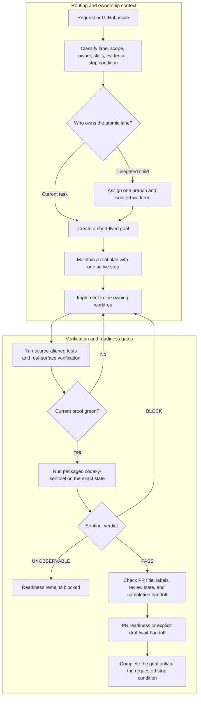
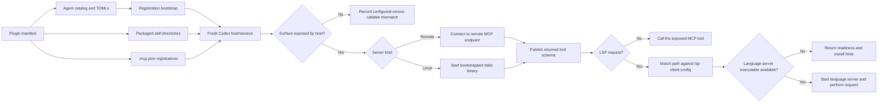

# Codexy plugin architecture

Codexy is a plugin-first harness for turning repository work into owned,
verifiable delivery lanes. This guide describes the components that ship in the
plugin and the workflow implemented by their current configuration. The source
of truth remains the packaged files linked below; being packaged or configured
does not by itself guarantee that a particular Codex host exposes the surface in
an already-running session.

## Specialist agents

The packaged catalog lists one TOML file per specialist. The plugin interface in
[`agents/openai.yaml`](../plugins/codexy/agents/openai.yaml) starts Codexy itself;
it is not another specialist. Agent files are discovered through
[`catalog.toml`](../plugins/codexy/agents/catalog.toml) and projected into Codex's
native custom-agent location by the registration bootstrap.

| Agent | Model | Reasoning effort | Role |
| --- | --- | --- | --- |
| `codexy-architect` | `gpt-5.6-sol` | `high` | Defines conservative boundaries for plugin schemas, orchestration contracts, MCP/LSP wiring, validators, and durable extension points. |
| `codexy-auditor` | `gpt-5.6-terra` | `medium` | Turns acceptance criteria into observable QA across configuration, documentation, CLI, GitHub, app, and plugin surfaces. |
| `codexy-cartographer` | `gpt-5.6-luna` | `low` | Performs fast, read-only repository discovery with codegraph, direct reads, file mapping, and ownership boundaries. |
| `codexy-forge` | `gpt-5.6-terra` | `medium` | Makes scoped edits after the issue, branch, worktree, plan, allowed paths, and acceptance criteria are fixed. |
| `codexy-pathfinder` | `gpt-5.6-sol` | `xhigh` | Converts ambiguous or cross-surface requests into atomic lanes, owners, proof plans, and stop conditions. |
| `codexy-scribe` | `gpt-5.6-luna` | `low` | Writes concise README, skill, PR, release, marketplace, and workflow documentation after behavior is known. |
| `codexy-sculptor` | `gpt-5.6-terra` | `high` | Performs behavior-preserving refactors, helper extraction, module splits, and structural LOC remediation. |
| `codexy-sentinel` | `gpt-5.6-sol` | `xhigh` | Runs the mandatory adversarial final review of scope, correctness, safety, tests, and current-head evidence. |
| `codexy-shipwright` | `gpt-5.6-terra` | `high` | Prepares version, manifest, marketplace, artifact, tag, release, and rollback readiness. |
| `codexy-tracer` | `gpt-5.6-sol` | `high` | Reproduces and isolates failing tests, broken automation, flaky workflows, and unexpected connector behavior. |
| `codexy-warden` | `gpt-5.6-sol` | `xhigh` | Reviews workflows, shell commands, credentials, remote MCPs, untrusted input, permissions, and state mutation. |
| `codexy-weaver` | `gpt-5.6-terra` | `medium` | Reconciles parallel lanes, branch heads, conflicts, PR evidence, merge ordering, and post-merge synchronization. |

These model assignments come directly from the packaged TOMLs. A named custom
agent's TOML is authoritative for its model and reasoning effort; callers should
not silently override it.

## Packaged skills

Skills are instruction packages discovered from
[`skills/*/SKILL.md`](../plugins/codexy/skills). Their frontmatter describes when
they must be selected; the body supplies the executable workflow and evidence
rules.

| Skill | Trigger / use | Responsibility |
| --- | --- | --- |
| `agents-md-authoring` | Creating, moving, reviewing, or changing an `AGENTS.md`. | Keeps instruction scope, precedence, mandatory wording, and readback verification correct. |
| `codex-orchestration` | Coordinating goals, plans, issue-sized lanes, agents, threads, or worktrees. | Owns the execution loop, routing boundaries, tool evidence, budgets, and final reviewer gate. |
| `debugging` | Behavior is wrong, tests fail, automation hangs, or the root cause is unknown. | Reproduces the failure, isolates cause, makes a narrow repair, and proves the regression. |
| `domain-driven-development` | Work changes business concepts, workflows, invariants, permissions, or module ownership. | Protects domain language, bounded contexts, state transitions, and ownership rules. |
| `dreaming` | A lane resumes after compaction or inherited context may be stale. | Separates durable facts and active fixes from resolved or superseded history. |
| `frontend-design` | Building, redesigning, auditing, or visually verifying a user-facing product surface. | Grounds UI work in evidence and verifies interaction, layout, accessibility, and responsiveness. |
| `git-workflow` | Any Codexy Git, issue, branch, worktree, PR, review, merge, or main-sync work. | Enforces issue-backed branches, isolated worktrees, verification, review handling, and GitHub gates. |
| `plugin-marketplace-prep` | Preparing manifests, marketplace entries, install candidates, assets, or plugin metadata. | Verifies packaged paths, schema, installability, metadata parity, and distribution readiness. |
| `proof-driven-completion` | Before claiming success, handing off, opening or merging a PR, or completing a goal. | Maps every requirement to current authoritative evidence and blocks unsupported completion claims. |
| `qa` | Verifying completed work, acceptance criteria, a release candidate, or PR readiness. | Drives the real CLI, GitHub, app, plugin, config, docs, or browser surface behind each claim. |
| `refactoring` | Restructuring existing code without changing behavior or reducing oversized modules. | Preserves contracts while reducing coupling, extracting responsibilities, and enforcing LOC limits. |
| `release-engineering` | Preparing versions, changelogs, release workflows, tags, publishing, or rollback. | Synchronizes version sources and proves package, artifact, distribution, and rollback gates. |
| `spec-driven-development` | Starting from an issue, PRD, user story, design brief, or acceptance criteria. | Converts the spec into one atomic outcome, explicit non-goals, success criteria, and proof plan. |
| `task-classification` | Every incoming Codexy task, before setup, edits, validation, or PR handling. | Selects the lane type, owner, atomic scope, required skills/tools, evidence, and first allowed action. |
| `test-driven-development` | Implementing a feature, fix, refactor, validator, docs rule, or workflow behavior. | Requires a faithful RED proof, the smallest GREEN change, and proportional broader verification. |
| `token-efficient-orchestration` | Long multi-PR, review-response, or compaction-recovery loops. | Keeps current event deltas and ledgers without dropping proof gates or creating autonomous polling. |
| `wiki` | Building or operating a topic-scoped compiled knowledge base. | Handles source collection, inventory, ingestion, compilation, query, audit, archive, and session context. |

## MCP servers

The plugin manifest points `mcpServers` at
[`plugins/codexy/.mcp.json`](../plugins/codexy/.mcp.json). That file registers
two plugin-local stdio servers and one remote HTTP server. Registration tells a
host how to resolve a server; runtime startup and tool exposure still belong to
the host and the current session.

| Server | Registration | Runtime boundary | Capabilities and tools |
| --- | --- | --- | --- |
| `codegraph` | Plugin-relative `./mcp/codexy-mcp-codegraph --stdio`. | A bootstrapped Codexy runtime binary runs as a local stdio child process. | `codegraph_overview`, `codegraph_search`, `codegraph_neighbors`, `codegraph_index`, `codegraph_reverse_deps`, and `codegraph_neighborhood` provide bounded repository maps and dependency-oriented discovery. |
| `grep_app` | Remote endpoint `https://mcp.grep.app`. | The remote service owns transport, availability, and its tool schema; the plugin does not ship its implementation. | Searches public GitHub code. A host may expose a tool such as `searchGitHub`, but the remote service's current schema is not a static repository guarantee. |
| `lsp` | Plugin-relative `./mcp/codexy-mcp-lsp --stdio`. | A local stdio server reads the packaged client config, then starts a matching language server only when its executable is installed. | `lsp_list_servers`, `lsp_for_path`, `lsp_status`, `lsp_document_symbols`, `lsp_definition`, `lsp_references`, and `lsp_diagnostics` cover discovery, readiness, and language-aware requests. |

For LSP, [`lsp-client.json`](../plugins/codexy/.codex/lsp-client.json) is the
machine-readable client registration and
[`server-catalog.toml`](../plugins/codexy/lsp/server-catalog.toml) carries the
validated language, extension, command, and install-hint catalog. A matching
entry does not claim that the executable is installed.

### Configured versus callable

`codex plugin list` and `codex mcp list` can prove that Codex knows about a
plugin or server. They do not prove that an already-running host loaded the
registration, started the local binary or reached the remote endpoint, and
published every tool into the active callable surface. A fresh session may be
required after installation or update. When a registered server is missing from
the actual tool surface, Codexy treats that mismatch as evidence to record, not
as permission to claim the server worked.

## Implemented orchestration

The main flow comes from `task-classification`, `codex-orchestration`,
`git-workflow`, `qa`, and `proof-driven-completion`. Routing context selects the
owner and execution lane; verification and readiness checks are separate hard
gates and cannot be replaced by contextual hook messages.



The owning lane keeps review-response fixes on the same branch. A `BLOCK`
starts a fresh repair proof and a fresh Sentinel review; an `UNOBSERVABLE`
result is not approval. Opening a PR is only a terminal state when the request
explicitly says to stop, wait, or leave it open.

## Plugin and runtime discovery

This second workflow is useful because configuration, installation, process
startup, and active-session exposure are distinct states. It also shows where
LSP resolution can legitimately stop without making a language-aware request.



## Keeping the guide current

The focused architecture inventory test reads the packaged agent catalog and
TOMLs, every skill frontmatter block, and `.mcp.json`, then compares them with
the three tables above. It rejects omitted or duplicate entries and stale agent
model or reasoning values. Run it with:

```sh
cargo test --test suite_all architecture_docs_inventory
```

The repository's broader plugin validator remains responsible for manifest,
agent catalog, skill frontmatter, MCP, and LSP configuration integrity:

```sh
scripts/validate-plugin-config --check
```
