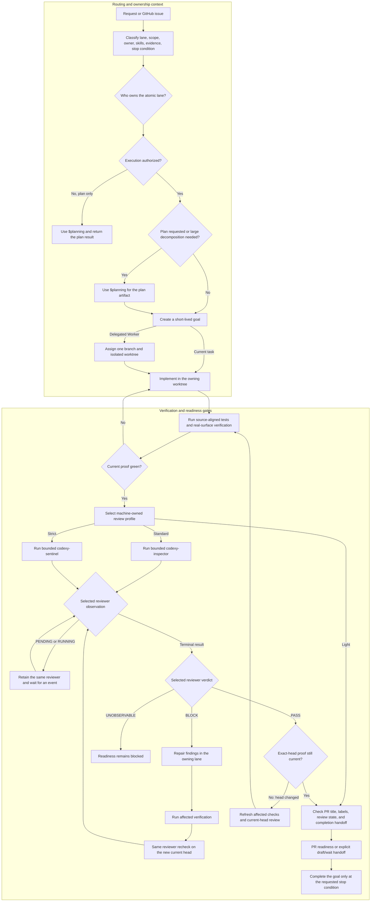
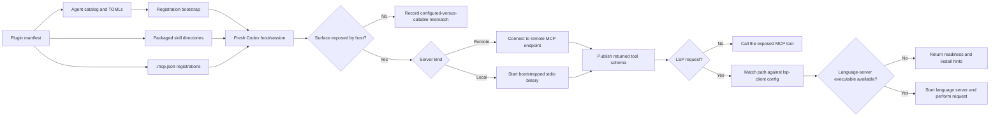

# Codexy plugin architecture

Codexy is a plugin-first harness for turning repository work into owned,
verifiable delivery lanes. This guide describes the components that ship in the
plugin and the workflow implemented by their current configuration. The source
of truth remains the packaged files linked below; being packaged or configured
does not by itself guarantee that a particular Codex host exposes the surface in
an already-running session.

The frozen target ownership for the future core, GitHub, and developer-tools
products is defined in the
[three-plugin product boundary](plugin-product-boundary.md).

## Specialist agents

The packaged catalog lists one TOML file per specialist. The plugin interface in
[`agents/openai.yaml`](../plugins/codexy/agents/openai.yaml) starts Codexy
itself; [`catalog.toml`](../plugins/codexy/agents/catalog.toml) and the
registration bootstrap discover and project the specialist files into Codex's
native location.

| Agent                 | Model           | Reasoning effort | Role                                                                                                                                                |
| --------------------- | --------------- | ---------------- | --------------------------------------------------------------------------------------------------------------------------------------------------- |
| `codexy-architect`    | `gpt-6-astra`   | `high`           | Defines conservative boundaries for plugin schemas, orchestration contracts, MCP/LSP wiring, validators, and durable extension points.              |
| `codexy-auditor`      | `gpt-5.6-terra` | `medium`         | Turns acceptance criteria into observable QA across configuration, documentation, CLI, GitHub, app, and plugin surfaces.                            |
| `codexy-cartographer` | `gpt-5.6-luna`  | `low`            | Performs fast, read-only repository discovery with codegraph, direct reads, file mapping, and ownership boundaries.                                 |
| `codexy-inspector`    | `gpt-5.6-sol`   | `medium`         | Performs the single bounded standard-profile review of current acceptance, changed files, and direct correctness, regression, and scope boundaries. |
| `codexy-sentinel`     | `gpt-6-astra`   | `xhigh`          | Runs the mandatory adversarial final review of scope, correctness, safety, tests, and current-head evidence.                                        |
| `codexy-shipwright`   | `gpt-5.6-terra` | `high`           | Prepares version, manifest, marketplace, artifact, tag, release, and rollback readiness.                                                            |
| `codexy-warden`       | `gpt-6-astra`   | `xhigh`          | Reviews workflows, shell commands, credentials, remote MCPs, untrusted input, permissions, and state mutation.                                      |

| `codexy-watcher` | `gpt-5.6-luna` | `max` | Performs bounded native read-only
Worker observation and reports material events through the core Watcher MCP. |

These model assignments come directly from the packaged TOMLs, which are
authoritative for a named custom agent's model and reasoning effort. Callers
should not silently override them.

The optional `codexy-github` plugin separately packages `codexy-weaver` for
GitHub integration after installation.

Removed-role rationale and the Inspector distinction are in
[`specialist-role-equivalence.md`](specialist-role-equivalence.md).

## Packaged skills

Skills are instruction packages discovered from
[`skills/*/SKILL.md`](../plugins/codexy/skills). Their frontmatter describes
when they must be selected; the body supplies the executable workflow and
evidence rules.

The optional `codexy-github` package separately provides `git-workflow` for
GitHub issue, branch, PR, review, merge, and main-sync work in any repository
after installation.

| Skill                          | Decision | Trigger / use                                                                                                                                                                      | Responsibility                                                                                                                                                                                                                                            |
| ------------------------------ | -------- | ---------------------------------------------------------------------------------------------------------------------------------------------------------------------------------- | --------------------------------------------------------------------------------------------------------------------------------------------------------------------------------------------------------------------------------------------------------- |
| `agents-md-authoring`          | Keep     | Creating, moving, reviewing, or changing an `AGENTS.md`.                                                                                                                           | Keeps instruction scope, precedence, mandatory wording, and readback verification correct.                                                                                                                                                                |
| `orchestration`                | Keep     | Use when classifying workflow, surface, and risk or coordinating ownership, goals, agents, threads, worktrees, reviews, compaction, and handoff; load only applicable authorities. | Owns task classification, ownership, assignment, worktree, dispatch, execution coordination, tool evidence, budgets, compact event deltas, and reviewer/merge gates; it does not own plan content or plan-file rules.                                     |
| `goal-lifecycle`               | Keep     | Using real goal tools or resuming a task controlled by a goal state.                                                                                                               | Recovers a stale blocked goal administratively, or uses a refusal-only same-directory fork/archive/null-goal fallback, then requires a fresh active goal before work without treating control-plane unblocking as product completion.                     |
| `realtime-voice-orchestration` | Keep     | Routing realtime voice task or status requests to an authoritative Orchestrator and summarizing verified progress.                                                                 | Provides a voice-specific routing and presentation adapter while normal orchestration remains canonical; preserves Orchestrator-owned Worker coordination, standalone routing, interruption-first behavior, bounded monitoring, and release-phase limits. |
| `engineering`                  | Keep     | One atomic outcome has an engineering boundary requiring diagnosis, specification, domain modeling, TDD, refactoring, or QA.                                                       | Owns technical design, implementation, and verification for one assigned atomic issue, then selects only the needed diagnosis, specification, domain-modeling, TDD, refactoring, and QA sections.                                                         |
| `planning`                     | Keep     | Creating or updating actionable project plans with optional local persistence.                                                                                                     | Owns plan content, updates, and local plan-file rules for explicit planning or necessary large-work decomposition; produces self-contained, source-backed plans without creating execution authority, issues, or new receipts.                            |
| `dreaming`                     | Keep     | A lane resumes after compaction or inherited context may be stale.                                                                                                                 | Separates durable facts and active fixes from resolved or superseded history.                                                                                                                                                                             |
| `proof-driven-completion`      | Keep     | Before claiming success, handing off, opening or merging a PR, or completing a goal.                                                                                               | Maps every requirement to current authoritative evidence and blocks unsupported completion claims.                                                                                                                                                        |
| `wiki`                         | Keep     | A natural-language request builds or operates one bounded, source-backed topic knowledge base.                                                                                     | Handles source collection, inventory, ingestion, compilation, query, audit, archive, and session context; it is not for ordinary repository search, README summary, planning, session memory, or unrelated research.                                      |
| `plan-stress-test`             | Keep     | The user explicitly opts in to stress-test one important plan with acceptance criteria before implementation.                                                                      | Challenges one invalidating causal assumption with the smallest discriminating probe and returns a bounded read-only advisory receipt without routing, mutation, review, or completion authority.                                                         |
| `frame-alternatives`           | Keep     | The user explicitly asks to surface credible alternatives for one proposed direction against supplied authoritative constraints.                                                   | Preserves the current frame, surfaces up to three credible constraint-compatible alternatives and owner questions, and does not choose, rank, mutate, verify, or reassign.                                                                                |
| `decision-rationale`           | Keep     | A user has already chosen one option and asks to inspect its stated reason and supplied evidence.                                                                                  | Records the stated reason, evidence support, narrowest unsupported assumption, and observable reopen condition without changing, recommending, approving, or fact-checking the decision.                                                                  |
| `prune-artifact-claims`        | Keep     | One exact non-code artifact must be refreshed against one exact governing source.                                                                                                  | Removes only conflicting, superseded, or internally duplicated claims while preserving the governing source, every other path, and a closed hash-backed receipt.                                                                                          |
| `blind-read`                   | Keep     | A fresh reader must interpret one artifact for one named audience and action without outside context.                                                                              | Projects the artifact's immediate purpose, unresolved references, and action blockers without judging, editing, fact-checking, or reconstructing hidden context.                                                                                          |
| `project-brief`                | Keep     | A person returns to an ongoing task and needs a read-only brief of recorded current state.                                                                                         | Projects only recorded task, Git/PR, proof, and release fields for human re-entry without inventing state or changing ownership, status, plans, actions, or completion.                                                                                   |

## Repository-only skills

Codex discovers these maintenance workflows from
[`.agents/skills`](../.agents/skills) while working in this repository. They
remain deliberately outside the Codexy plugin payload.

| Skill                     | Decision        | Trigger / use                                                                                                                          | Responsibility                                                                                                              |
| ------------------------- | --------------- | -------------------------------------------------------------------------------------------------------------------------------------- | --------------------------------------------------------------------------------------------------------------------------- |
| `mcp-test`                | Repository-only | Running or comparing explicit local MCP scenarios during Codexy development.                                                          | Exercises the repository's bounded scenario producers without adding the skill or its CLI to an installed plugin payload.   |
| `plugin-marketplace-prep` | Repository-only | Preparing manifests, marketplace listings, skill bundles, install candidates, assets, metadata, validation, or distribution readiness. | Proves the Codexy install and marketplace surface without making this workflow part of that installed surface.              |
| `release-engineering`     | Repository-only | Preparing versions, changelogs, release notes, tags, packaging, release flows, distribution checks, rollback plans, or publishing.     | Owns version, artifact, publication, and rollback gates for this repository.                                                |
| `skill-evaluation`        | Repository-only | Evaluating a shipped skill with private cases for semantic behavior, authority boundaries, schema fidelity, or execution cost.         | Separates evaluator-owned cases and evidence from shipped prompts while recording exact schema and measured execution cost. |

### Overlap boundaries

| Boundary                        | Before                                                                                                    | After                                                                                                                                                                                                                                                                                                                                                                |
| ------------------------------- | --------------------------------------------------------------------------------------------------------- | -------------------------------------------------------------------------------------------------------------------------------------------------------------------------------------------------------------------------------------------------------------------------------------------------------------------------------------------------------------------- |
| Routing, execution, and context | Plan artifacts, classification, execution, recovery, and compact coordination can all mention lane state. | `$planning` owns plan content, updates, and plan-file rules; `orchestration` selects the lane and owner, assigns work, coordinates execution, and preserves current event deltas; `dreaming` independently restores durable context.                                                                                                                                 |
| Engineering workflow selection  | Diagnosis, specification, domain modeling, TDD, refactoring, and QA can all apply to one outcome.         | `engineering` owns technical design, implementation, and verification for one assigned atomic issue, then selects only the needed sections: specification defines the outcome and proofs; domain modeling owns language and invariants; diagnosis starts from unexpected behavior or an unknown cause; refactoring preserves behavior; QA observes the real surface. |
| Verification and completion     | Engineering proof and the final claim can both report readiness.                                          | `engineering` supplies regression and observable-surface evidence; `proof-driven-completion` audits the final claim separately.                                                                                                                                                                                                                                      |
| Packaging and release           | Package metadata validation can be confused with a release.                                               | Repository-only `plugin-marketplace-prep` proves the install surface; repository-only `release-engineering` owns version, artifact, publication, and rollback gates.                                                                                                                                                                                                 |

## Skill path-consumer map

All 15 stable core packaged `skills/<name>/SKILL.md` paths in the inventory
above have a matching `skills/<name>/agents/openai.yaml`. The repository-only
skills use the equivalent `.agents/skills/<name>/` paths. The planning bundle's
optional `references/**` resources use the existing Skill resources consumer.
These consumer classes cover selection, registration, references, validation,
tests, and user-facing prompts.

| Consumer class               | Paths                                                                                                                                                                                                                                                                                                                          | Contract                                                                                                                                       |
| ---------------------------- | ------------------------------------------------------------------------------------------------------------------------------------------------------------------------------------------------------------------------------------------------------------------------------------------------------------------------------ | ---------------------------------------------------------------------------------------------------------------------------------------------- |
| Host discovery               | `.codex-plugin/plugin.json`, `skills/*/SKILL.md`, `.agents/skills/*/SKILL.md`                                                                                                                                                                                                                                                  | Discovers packaged and repository-only skill folders and reads frontmatter trigger metadata.                                                   |
| Skill prompt metadata        | `skills/*/agents/openai.yaml`, `.agents/skills/*/agents/openai.yaml`, `packages/codexy-runtime/src/validation/roles_yaml.rs`                                                                                                                                                                                                   | Publishes display names, invocation prompts, and implicit-invocation policy.                                                                   |
| Plugin entry prompt          | `agents/openai.yaml`, `packages/codexy-runtime/tests/validator_prompt_metadata.rs`                                                                                                                                                                                                                                             | Routes users through `$orchestration` and named skill invocations.                                                                             |
| Structural plugin validation | `packages/codexy-runtime/src/validation/manifest.rs`, `packages/codexy-runtime/src/validation/markdown.rs`, `packages/codexy-runtime/src/validation/roles_yaml.rs`, `packages/codexy-runtime/src/validation/mcp.rs`, `packages/codexy-runtime/src/validation/lsp.rs`, `packages/codexy-runtime/tests/skill_reference_links.rs` | Validates manifests, frontmatter, schemas, paths, inventories, links, and package configuration without interpreting skill or reference prose. |
| Inventory and taxonomy tests | `packages/codexy-runtime/tests/architecture_docs_inventory.rs`, `packages/codexy-runtime/tests/skill_boundary_taxonomy.rs`                                                                                                                                                                                                     | Enforces folder/frontmatter identity, one decision per skill, path stability, and documented boundaries.                                       |
| Skill resources              | `skills/*/references/**`, `skills/*/templates/**`, cross-skill `$name` links                                                                                                                                                                                                                                                   | Supplies detailed workflows and preserves referenced paths without duplicating core skill bodies.                                              |

## MCP servers

The optional Codexy Devtools manifest points `mcpServers` at
[`plugins/codexy-devtools/.mcp.json`](../plugins/codexy-devtools/.mcp.json).
That file registers two plugin-local stdio servers; core Codexy registers its
required Watcher server in the corresponding core manifest. Registration tells a
host how to resolve a server; runtime startup and tool exposure still belong to
the host and the current session.

| Server      | Registration                                                                                                                | Runtime boundary                                                                                                                                                      | Capabilities and tools                                                                                                                                                                                                                                                                                                                  |
| ----------- | --------------------------------------------------------------------------------------------------------------------------- | --------------------------------------------------------------------------------------------------------------------------------------------------------------------- | --------------------------------------------------------------------------------------------------------------------------------------------------------------------------------------------------------------------------------------------------------------------------------------------------------------------------------------- |
| `codegraph` | `{"command":"uv","args":["run","--no-project","--script","./mcp/codexy_mcp_bootstrap.py","codegraph","--stdio"],"cwd":"."}` | The metadata-driven bootstrap reads the selected plugin release and starts the matching Codexy runtime as a local stdio child process.                                | `codegraph_overview`, `codegraph_search`, `codegraph_neighbors`, `codegraph_index`, `codegraph_reverse_deps`, and `codegraph_neighborhood` provide bounded repository maps and dependency-oriented discovery; `codegraph_change_impact` and `codegraph_check_selection` add read-only change impact and advisory check recommendations. |
| `lsp`       | `{"command":"uv","args":["run","--no-project","--script","./mcp/codexy_mcp_bootstrap.py","lsp","--stdio"],"cwd":"."}`       | The metadata-driven bootstrap reads the selected plugin release, then starts LSP against the packaged client config when its language-server executable is installed. | `lsp_list_servers`, `lsp_for_path`, `lsp_status`, `lsp_document_symbols`, `lsp_definition`, `lsp_references`, `lsp_diagnostics`, and `lsp_batch` cover discovery, readiness, language-aware requests, and bounded batches.                                                                                                              |
| `watcher`   | `{"command":"uv","args":["run","--no-project","--script","./mcp/codexy_mcp_bootstrap.py","watcher","--stdio"],"cwd":"."}`   | The metadata-driven bootstrap reads the selected plugin release and starts the required Watcher runtime as a local stdio child process.                               | `watcher_open`, `watcher_report`, `watcher_wait`, `watcher_health`, and `watcher_cancel` expose the required native Codex observation boundary.                                                                                                                                                                                         |

Codegraph's change tools are read-only adapters over Git change collection,
bounded Python/Rust impact analysis, and explicit check mappings. They return
limits, unknown areas, recommendation reasons, gaps, broader verification, and
manual judgment so incomplete evidence stays visible. Recommendations contain
command text as data; they do not execute checks, waive checks, or decide
completion. The installed-wrapper demonstrations cover documentation, a single
module, and a shared fixture. Those subprocess checks prove the packaged runtime
only; active host exposure remains unobserved until the host's callable tool
list and a real invocation are separately verified.

### Repository-only MCP scenario testing

The repository-only [`mcp-test`](../.agents/skills/mcp-test/SKILL.md) skill and
[`run_scenario.py`](../.agents/skills/mcp-test/scripts/run_scenario.py) provide
development tooling outside the installed Devtools package. The CLI runs and
compares explicit local stdio targets using the scenario format in
[`scenario-format.md`](../.agents/skills/mcp-test/references/scenario-format.md):
ordered steps, selected stored fields, declared references, expectations, and
explicit target commands. Its support contract documents the trusted protocol
and platform boundary, including fail-closed behavior for unsupported versions
or platforms. Repository tests exercise a search-to-detail chain, a deliberate
comparison difference, and a linkage regression through a copied repository
tool bundle. These subprocess results prove repository-tool files and producer
provenance; they do not prove an active host's callable skill surface or an
app-level skill invocation.

### Selected batch-result application

The installed engineering workflow consumes a validated result from
[`batch_change_resume.py`](../plugins/codexy/skills/engineering/scripts/batch_change_resume/batch_change_resume.py)
through
[`batch_change.py`](../plugins/codexy/skills/engineering/scripts/batch_change.py)
and
[`batch-changes.md`](../plugins/codexy/skills/engineering/references/batch-changes.md).
The user must select successful item IDs explicitly. The route presents a
readable diff, rechecks the original immediately before each independent
replacement, and reads back every applied file. It preserves failed, unselected,
and user-changed originals while distinguishing completed, conflict, and
incomplete items; repeating an application reports an already completed item
instead of replacing it again.

Application state is workspace-local and is not component inventory or journal
state. The workflow does not provide multi-file atomicity, protection from
arbitrary concurrent writers, process resurrection, scheduled wakeups, or
automatic commit/push of user changes.

For LSP, [`lsp-client.json`](../plugins/codexy-devtools/.codex/lsp-client.json)
is the machine-readable client registration and
[`server-catalog.toml`](../plugins/codexy-devtools/lsp/server-catalog.toml)
carries the validated language, extension, command, and install-hint catalog. A
matching entry does not claim that the executable is installed.

### Configured versus callable

`codex plugin list` and `codex mcp list` can prove that Codex knows about a
plugin or server. They do not prove that an already-running host loaded the
registration, started the local binary or reached the remote endpoint, and
published every tool into the active callable surface. A fresh session may be
required after installation or update. When a registered server is missing from
the actual tool surface, Codexy treats that mismatch as evidence to record, not
as permission to claim the server worked.

### Runtime constraints

- `lsp_batch` accepts 1–8 requests that resolve to one server and workspace,
  with a shared deadline of at most 60,000 ms. Per-request timeouts are also
  capped at 60,000 ms; an unavailable language server returns readiness and
  install hints.
- Core hook timing is opt-in through `CODEXY_CORE_HOOK_TIMING_FILE`. When
  enabled, JSONL records contain only `event`, `concern`, `elapsed`, and
  `decision`, and the file is capped at 1 MiB. Timing failures never change hook
  policy.
- `getcodexy doctor` keeps `configured`, `loaded`, `callable`, and `verified`
  separate. A direct plugin-subprocess probe can establish the first three, but
  `verified` remains `unknown` without host/session evidence; `unknown` is
  non-proof for that observation and does not by itself classify overall health.
- Native Watcher observation uses one quiet `watcher_wait`: omitting `timeoutMs`
  selects the five-minute server-side default of 300,000 ms; the bounded
  `MAX_WAIT_MS` maximum remains 3,600,000 ms. An explicit shorter wait remains
  supported for a user deadline or a confirmed host limit. Same-connection
  `notifications/cancelled` releases only the pending request when the host
  propagates it and preserves the durable session; `watcher_cancel` separately
  ends that session and requires a fresh assignment.
- The core hook contract binds an authenticated Orchestrator `watcher_wait` in
  `PreToolUse` with an opaque `requestBinding`; the synchronous `Interrupt` hook
  writes a request-only cancellation marker consumed by the existing native 25
  ms wait check. Direct callers remain binding-free compatible, while a wrong
  turn/session, stale nonce, or durable `watcher_cancel` cannot release a
  different request.
- The source contract does not prove every host behavior. The verified host
  observation behind this contract showed that the one-hour request was bounded
  by an observed 300-second `tools/call` transport deadline; a host/task message
  or outer wait termination may leave the native wait active when the host does
  not propagate `Interrupt`. Candidate installation and actual host Stop proof
  remain separate acceptance evidence.

## Implemented orchestration

The main flow comes from `orchestration`, `git-workflow`, `engineering`, and
`proof-driven-completion`. Routing context selects the owner and execution lane;
verification and readiness checks are separate hard gates and cannot be replaced
by contextual hook messages.

The method is requirement-led. Acceptance criteria and material risks come
before issue-sized implementation, then the owner runs the relevant behavioral
checks and proves any claimed external surface on that surface. Executable
boundaries retain behavioral verification; test-first sequencing is separate:
reproducible defects require faithful RED before the fix, ordinary features and
behavior-preserving refactors may use optional ordering with the appropriate
baseline, and documentation or instruction prose uses structural proof instead
of manufactured RED. The
[engineering skill](../plugins/codexy/skills/engineering/SKILL.md) defines these
choices, while
[proof-driven completion](../plugins/codexy/skills/proof-driven-completion/SKILL.md)
audits the final current-state claim. Light, standard, and strict profiles
follow risk and surface. Reuse execution evidence per individual check, not as
whole-change readiness: after reading the current diff and the relevant
implementation, dependency or lock/configuration, fixtures, generated inputs,
and environment, a current applicability assessment may preserve a passed check
when its boundary and environment remain unchanged, including after unrelated
prose-only or other metadata-only changes. A relevant source, dependency,
lock/configuration, fixture, generated-input, or environment change, previous
failure, unresolved risk, or uncertain impact invalidates the affected evidence
and requires the check again. A reviewer PASS is always bound to its exact head;
an older PASS does not make a changed head current or allow affected checks to
be skipped.


```mermaid
flowchart TD
    subgraph routing["Routing and ownership context"]
        request["Request or GitHub issue"] --> classify["Classify lane, scope, owner, skills, evidence, stop condition"]
        classify --> owner{"Who owns the atomic lane?"}
        owner --> execution_gate{"Execution authorized?"}
        execution_gate -->|No, plan only| plan_only["Use $planning and return the plan result"]
        execution_gate -->|Yes| plan_gate{"Plan requested or large decomposition needed?"}
        plan_gate -->|Yes| plan["Use $planning for the plan artifact"]
        plan_gate -->|No| goal["Create a short-lived goal"]
        plan --> goal
        goal -->|Current task| implement["Implement in the owning worktree"]
        goal -->|Delegated Worker| worktree["Assign one branch and isolated worktree"]
        worktree --> implement
    end

    subgraph gates["Verification and readiness gates"]
        implement --> verify["Run source-aligned tests and real-surface verification"]
        verify --> proof{"Current proof green?"}
        proof -->|No| implement
        proof -->|Yes| profile["Select machine-owned review profile"]
        profile -->|Light| readiness["No LLM review"]
        profile -->|Standard| inspector["Run bounded codexy-inspector"]
        profile -->|Strict| sentinel["Run bounded codexy-sentinel"]
        inspector --> observation{"Selected reviewer observation"}
        sentinel --> observation
        observation -->|PENDING or RUNNING| wait_review["Retain the same reviewer and wait for an event"]
        wait_review --> observation
        observation -->|Terminal result| verdict{"Selected reviewer verdict"}
        verdict -->|BLOCK| repair["Repair findings in the owning lane"]
        repair --> affected["Run affected verification"]
        affected --> delta["Same reviewer recheck on the new current head"]
        delta --> observation
        verdict -->|UNOBSERVABLE| blocked["Readiness remains blocked"]
        verdict -->|PASS| head_gate{"Exact-head proof still current?"}
        head_gate -->|Yes| readiness["Check PR title, labels, review state, and completion handoff"]
        head_gate -->|No: head changed| refresh["Refresh affected checks and current-head review"]
        refresh --> verify
        readiness --> delivery["PR readiness or explicit draft/wait handoff"]
        delivery --> finish["Complete the goal only at the requested stop condition"]
    end
```

The owning lane keeps review-response fixes on the same branch. `PENDING` and
`RUNNING` retain the reviewer; `BLOCK` and `UNOBSERVABLE` keep readiness from
passing. Current-head identity, authenticated GitHub snapshots, ancestry, and
findings remain authoritative. A `PASS` supports readiness only when it has no
unresolved actionable findings and is bound to the exact current head. Missing
historical or optional connector evidence is unknown and does not add a gate.

## Plugin and runtime discovery

This workflow separates configuration, installation, process startup, and
active-session exposure, including the point where LSP resolution can stop.


```mermaid
flowchart LR
    manifest["Plugin manifest"] --> mcpconfig[".mcp.json registrations"]
    manifest --> skills["Packaged skill directories"]
    manifest --> agents["Agent catalog and TOMLs"]
    agents --> bootstrap["Registration bootstrap"]
    bootstrap --> fresh["Fresh Codex host/session"]
    skills --> fresh
    mcpconfig --> fresh

    fresh --> exposed{"Surface exposed by host?"}
    exposed -->|No| mismatch["Record configured-versus-callable mismatch"]
    exposed -->|Yes| server{"Server kind"}
    server -->|Remote| endpoint["Connect to remote MCP endpoint"]
    server -->|Local| binary["Start bootstrapped stdio binary"]
    endpoint --> tools["Publish returned tool schema"]
    binary --> tools

    tools --> lsprequest{"LSP request?"}
    lsprequest -->|No| call["Call the exposed MCP tool"]
    lsprequest -->|Yes| match["Match path against lsp-client config"]
    match --> available{"Language-server executable available?"}
    available -->|No| status["Return readiness and install hints"]
    available -->|Yes| language["Start language server and perform request"]
```

## Keeping the guide current

The focused architecture inventory test reads packaged agent catalog/TOMLs,
skill frontmatter, and `.mcp.json`, compares them with the three tables, rejects
omitted or duplicate entries and stale agent model/reasoning values. Run:

```sh
cargo test --manifest-path packages/codexy-runtime/Cargo.toml --test suite_system architecture_docs_inventory
```

The plugin validator checks manifest, agents, skills, MCP, and LSP integrity:

```sh
scripts/validate-plugin-config.sh --check
```
