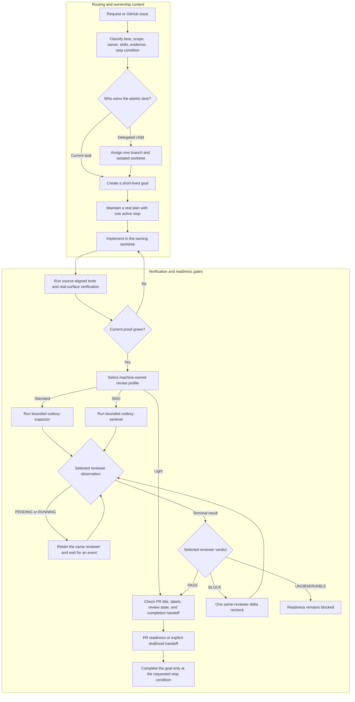
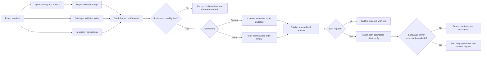

# Codexy plugin architecture

Codexy is a plugin-first harness for turning repository work into owned,
verifiable delivery lanes. This guide describes the components that ship in the
plugin and the workflow implemented by their current configuration. The source
of truth remains the packaged files linked below; being packaged or configured
does not by itself guarantee that a particular Codex host exposes the surface in
an already-running session.

The root README files are the complete public product overview for first-time
and returning readers. This guide carries the detailed architecture: package
boundaries, inventories, specialist and skill contracts, MCP/LSP registration,
runtime exposure, and the verification rules that keep those descriptions
source-aligned.

The frozen target ownership for the future core, GitHub, and developer-tools
products is defined in the
[three-plugin product boundary](plugin-product-boundary.md).

## Specialist agents

The packaged catalog lists one TOML file per specialist. The plugin interface in
[`agents/openai.yaml`](../plugins/codexy/agents/openai.yaml) starts Codexy
itself; it is not another specialist. Agent files are discovered through
[`catalog.toml`](../plugins/codexy/agents/catalog.toml) and projected into
Codex's native custom-agent location by the registration bootstrap.

| Agent                 | Model           | Reasoning effort | Role                                                                                                                                                |
| --------------------- | --------------- | ---------------- | --------------------------------------------------------------------------------------------------------------------------------------------------- |
| `codexy-architect`    | `gpt-5.6-sol`   | `high`           | Defines conservative boundaries for plugin schemas, orchestration contracts, MCP/LSP wiring, validators, and durable extension points.              |
| `codexy-auditor`      | `gpt-5.6-terra` | `medium`         | Turns acceptance criteria into observable QA across configuration, documentation, CLI, GitHub, app, and plugin surfaces.                            |
| `codexy-cartographer` | `gpt-5.6-luna`  | `low`            | Performs fast, read-only repository discovery with codegraph, direct reads, file mapping, and ownership boundaries.                                 |
| `codexy-inspector`    | `gpt-5.6-terra` | `max`            | Performs the single bounded standard-profile review of current acceptance, changed files, and direct correctness, regression, and scope boundaries. |
| `codexy-sentinel`     | `gpt-5.6-sol`   | `xhigh`          | Runs the mandatory adversarial final review of scope, correctness, safety, tests, and current-head evidence.                                        |
| `codexy-shipwright`   | `gpt-5.6-terra` | `high`           | Prepares version, manifest, marketplace, artifact, tag, release, and rollback readiness.                                                            |
| `codexy-warden`       | `gpt-5.6-sol`   | `xhigh`          | Reviews workflows, shell commands, credentials, remote MCPs, untrusted input, permissions, and state mutation.                                      |

These model assignments come directly from the packaged TOMLs. A named custom
agent's TOML is authoritative for its model and reasoning effort; callers should
not silently override it.

The optional `codexy-github` plugin separately packages `codexy-weaver` for
GitHub integration after that plugin is installed.

The role-equivalence boundary records why the removed roles are not aliases and
describes Inspector as a distinct profile-bound reviewer: see
[`specialist-role-equivalence.md`](specialist-role-equivalence.md).

## Packaged skills

Skills are instruction packages discovered from
[`skills/*/SKILL.md`](../plugins/codexy/skills). Their frontmatter describes
when they must be selected; the body supplies the executable workflow and
evidence rules.

The optional `codexy-github` package separately provides `git-workflow` for
GitHub issue, branch, PR, review, merge, and main-sync work after installation.

| Skill                          | Decision | Trigger / use                                                                                                                   | Responsibility                                                                                                                                                                                                                                    |
| ------------------------------ | -------- | ------------------------------------------------------------------------------------------------------------------------------- | ------------------------------------------------------------------------------------------------------------------------------------------------------------------------------------------------------------------------------------------------- |
| `agents-md-authoring`          | Keep     | Creating, moving, reviewing, or changing an `AGENTS.md`.                                                                        | Keeps instruction scope, precedence, mandatory wording, and readback verification correct.                                                                                                                                                        |
| `orchestration`                | Keep     | Classifying work and coordinating goals, plans, issue-sized lanes, agents, threads, worktrees, compaction, or token discipline. | Owns classification, the execution loop, routing boundaries, tool evidence, budgets, compact event deltas, and the final reviewer gate.                                                                                                           |
| `realtime-voice-orchestration` | Keep     | Routing realtime voice task or status requests to an authoritative project owner and summarizing verified progress.             | Provides a voice-specific routing and presentation adapter while normal orchestration remains canonical; preserves parent-only child coordination, standalone routing, interruption-first behavior, bounded monitoring, and release-phase limits. |
| `engineering`                  | Keep     | One atomic outcome has an engineering boundary requiring diagnosis, specification, domain modeling, TDD, refactoring, or QA.    | Selects the needed sections as one workflow while preserving their separate diagnosis, outcome/proof, domain-invariant, RED/GREEN for executable boundaries, behavior-preserving, and observable-surface responsibilities.                        |
| `dreaming`                     | Keep     | A lane resumes after compaction or inherited context may be stale.                                                              | Separates durable facts and active fixes from resolved or superseded history.                                                                                                                                                                     |
| `proof-driven-completion`      | Keep     | Before claiming success, handing off, opening or merging a PR, or completing a goal.                                            | Maps every requirement to current authoritative evidence and blocks unsupported completion claims.                                                                                                                                                |
| `wiki`                         | Keep     | Building or operating a topic-scoped compiled knowledge base.                                                                   | Handles source collection, inventory, ingestion, compilation, query, audit, archive, and session context.                                                                                                                                         |
| `plan-stress-test`             | Keep     | The user explicitly opts in to stress-test one important plan with acceptance criteria before implementation.                   | Challenges one invalidating causal assumption with the smallest discriminating probe and returns a bounded read-only advisory receipt without routing, mutation, review, or completion authority.                                                 |
| `frame-check`                  | Keep     | The user explicitly asks to check one proposed direction against supplied authoritative constraints.                            | Preserves the current frame, surfaces up to three credible constraint-compatible alternatives and owner questions, and does not choose, rank, mutate, verify, or reassign.                                                                        |
| `decision-rationale`           | Keep     | A user has already chosen one option and asks to inspect its stated reason and supplied evidence.                               | Records the stated reason, evidence support, narrowest unsupported assumption, and observable reopen condition without changing, recommending, approving, or fact-checking the decision.                                                          |
| `artifact-refresh`             | Keep     | One exact non-code artifact must be refreshed against one exact governing source.                                               | Removes only conflicting, superseded, or internally duplicated claims while preserving the governing source, every other path, and a closed hash-backed receipt.                                                                                  |
| `blind-read`                   | Keep     | A fresh reader must interpret one artifact for one named audience and action without outside context.                           | Projects the artifact's immediate purpose, unresolved references, and action blockers without judging, editing, fact-checking, or reconstructing hidden context.                                                                                  |
| `project-brief`                | Keep     | A person returns to an ongoing task and needs a read-only brief of recorded current state.                                      | Projects only recorded task, Git/PR, proof, and release fields for human re-entry without inventing state or changing ownership, status, plans, actions, or completion.                                                                           |

## Repository-only skills

Codex discovers these maintenance workflows from
[`.agents/skills`](../.agents/skills) while working in this repository. They
remain deliberately outside the Codexy plugin payload.

| Skill                     | Decision        | Trigger / use                                                                                                                          | Responsibility                                                                                                 |
| ------------------------- | --------------- | -------------------------------------------------------------------------------------------------------------------------------------- | -------------------------------------------------------------------------------------------------------------- |
| `plugin-marketplace-prep` | Repository-only | Preparing manifests, marketplace listings, skill bundles, install candidates, assets, metadata, validation, or distribution readiness. | Proves the Codexy install and marketplace surface without making this workflow part of that installed surface. |
| `release-engineering`     | Repository-only | Preparing versions, changelogs, release notes, tags, packaging, release flows, distribution checks, rollback plans, or publishing.     | Owns version, artifact, publication, and rollback gates for this repository.                                   |

### Overlap boundaries

| Boundary                        | Before                                                                                            | After                                                                                                                                                                                                                                                                                                                                      |
| ------------------------------- | ------------------------------------------------------------------------------------------------- | ------------------------------------------------------------------------------------------------------------------------------------------------------------------------------------------------------------------------------------------------------------------------------------------------------------------------------------------ |
| Routing, execution, and context | Classification, execution, recovery, and compact coordination can all mention lane state.         | `orchestration` selects the lane and owner, runs it, and preserves current event deltas; `dreaming` independently restores durable context.                                                                                                                                                                                                |
| Engineering workflow selection  | Diagnosis, specification, domain modeling, TDD, refactoring, and QA can all apply to one outcome. | `engineering` selects only the needed sections: task classification decides TDD for executable boundaries; specification defines the atomic outcome and proofs; domain modeling owns language and invariants; diagnosis starts from unexpected behavior or an unknown cause; refactoring preserves behavior; QA observes the real surface. |
| Verification and completion     | Engineering proof and the final claim can both report readiness.                                  | `engineering` supplies regression and observable-surface evidence; `proof-driven-completion` audits the final claim separately.                                                                                                                                                                                                            |
| Packaging and release           | Package metadata validation can be confused with a release.                                       | Repository-only `plugin-marketplace-prep` proves the install surface; repository-only `release-engineering` owns version, artifact, publication, and rollback gates.                                                                                                                                                                       |

## Skill path-consumer map

All 13 stable core packaged `skills/<name>/SKILL.md` paths in the inventory
above have a matching `skills/<name>/agents/openai.yaml`. The two
repository-only skills use the equivalent `.agents/skills/<name>/` paths. These
consumer classes cover their selection, registration, references, validation,
tests, and user-facing prompts.

| Consumer class               | Paths                                                                                                                                                                                                                                                                                                                          | Contract                                                                                                                                       |
| ---------------------------- | ------------------------------------------------------------------------------------------------------------------------------------------------------------------------------------------------------------------------------------------------------------------------------------------------------------------------------ | ---------------------------------------------------------------------------------------------------------------------------------------------- |
| Host discovery               | `.codex-plugin/plugin.json`, `skills/*/SKILL.md`, `.agents/skills/*/SKILL.md`                                                                                                                                                                                                                                                  | Discovers packaged and repository-only skill folders and reads frontmatter trigger metadata.                                                   |
| Skill prompt metadata        | `skills/*/agents/openai.yaml`, `.agents/skills/*/agents/openai.yaml`, `packages/codexy-runtime/src/validation/roles_yaml.rs`                                                                                                                                                                                                   | Publishes display names, invocation prompts, and implicit-invocation policy.                                                                   |
| Plugin entry prompt          | `agents/openai.yaml`, `packages/codexy-runtime/tests/validator_prompt_metadata.rs`                                                                                                                                                                                                                                             | Routes users through `$orchestration` and named skill invocations.                                                                             |
| Structural plugin validation | `packages/codexy-runtime/src/validation/manifest.rs`, `packages/codexy-runtime/src/validation/markdown.rs`, `packages/codexy-runtime/src/validation/roles_yaml.rs`, `packages/codexy-runtime/src/validation/mcp.rs`, `packages/codexy-runtime/src/validation/lsp.rs`, `packages/codexy-runtime/tests/skill_reference_links.rs` | Validates manifests, frontmatter, schemas, paths, inventories, links, and package configuration without interpreting skill or reference prose. |
| Inventory and taxonomy tests | `packages/codexy-runtime/tests/architecture_docs_inventory.rs`, `packages/codexy-runtime/tests/skill_boundary_taxonomy.rs`                                                                                                                                                                                                     | Enforces folder/frontmatter identity, one decision per skill, path stability, and documented boundaries.                                       |
| Skill resources              | `skills/*/references/**`, `skills/*/templates/**`, cross-skill `$name` links                                                                                                                                                                                                                                                   | Supplies detailed workflows and preserves referenced paths without duplicating core skill bodies.                                              |

## MCP servers

The optional Codexy Devtools manifest points `mcpServers` at
[`plugins/codexy-devtools/.mcp.json`](../plugins/codexy-devtools/.mcp.json).
That file registers two plugin-local stdio servers; core Codexy registers none.
Registration tells a host how to resolve a server; runtime startup and tool
exposure still belong to the host and the current session.

| Server      | Registration                                                                       | Runtime boundary                                                                                                                                     | Capabilities and tools                                                                                                                                                                                        |
| ----------- | ---------------------------------------------------------------------------------- | ---------------------------------------------------------------------------------------------------------------------------------------------------- | ------------------------------------------------------------------------------------------------------------------------------------------------------------------------------------------------------------- |
| `codegraph` | `{"command":"./mcp/codexy-mcp-devtools","args":["codegraph","--stdio"],"cwd":"."}` | A bootstrapped Codexy runtime binary runs as a plugin-relative local stdio child process.                                                            | `codegraph_overview`, `codegraph_search`, `codegraph_neighbors`, `codegraph_index`, `codegraph_reverse_deps`, and `codegraph_neighborhood` provide bounded repository maps and dependency-oriented discovery. |
| `lsp`       | `{"command":"./mcp/codexy-mcp-devtools","args":["lsp","--stdio"],"cwd":"."}`       | A plugin-relative local stdio server reads the packaged client config, then starts a matching language server only when its executable is installed. | `lsp_list_servers`, `lsp_for_path`, `lsp_status`, `lsp_document_symbols`, `lsp_definition`, `lsp_references`, and `lsp_diagnostics` cover discovery, readiness, and language-aware requests.                  |

Registration cells reproduce the complete JSON object so argument boundaries and
simultaneously configured fields remain source-verifiable rather than being
flattened into command-line prose.

For LSP, [`lsp-client.json`](../plugins/codexy-devtools/.codex/lsp-client.json)
is the machine-readable client registration and
[`server-catalog.toml`](../plugins/codexy-devtools/lsp/server-catalog.toml)
carries the validated language, extension, command, and install-hint catalog. A
matching entry does not claim that the executable is installed.

### Configured versus callable

`codex plugin list` and `codex mcp list` can prove that Codex knows about a
plugin or server. They do not prove that an already-running host loaded the
registration, started the local binary or reached the remote endpoint, and
published every tool into the active callable surface. A fresh session may be
required after installation or update. When a registered server is missing from
the actual tool surface, Codexy treats that mismatch as evidence to record, not
as permission to claim the server worked.

## Implemented orchestration

The main flow comes from `orchestration`, `git-workflow`, `engineering`, and
`proof-driven-completion`. Routing context selects the owner and execution lane;
verification and readiness checks are separate hard gates and cannot be replaced
by contextual hook messages.


```mermaid
flowchart TD
    subgraph routing["Routing and ownership context"]
        request["Request or GitHub issue"] --> classify["Classify lane, scope, owner, skills, evidence, stop condition"]
        classify --> owner{"Who owns the atomic lane?"}
        owner -->|Current task| goal["Create a short-lived goal"]
        owner -->|Delegated child| worktree["Assign one branch and isolated worktree"]
        worktree --> goal
        goal --> plan["Maintain a real plan with one active step"]
        plan --> implement["Implement in the owning worktree"]
    end

    subgraph gates["Verification and readiness gates"]
        implement --> verify["Run source-aligned tests and real-surface verification"]
        verify --> proof{"Current proof green?"}
        proof -->|No| implement
        proof -->|Yes| profile["Select machine-owned review profile"]
        profile -->|Light| readiness["No LLM review"]
        profile -->|Standard| inspector["Run bounded codexy-inspector"]
        profile -->|Strict| sentinel["Run bounded codexy-sentinel"]
        inspector --> observation{"Selected reviewer observation"}
        sentinel --> observation
        observation -->|PENDING or RUNNING| wait_review["Retain the same reviewer and wait for an event"]
        wait_review --> observation
        observation -->|Terminal result| verdict{"Selected reviewer verdict"}
        verdict -->|BLOCK| delta["One same-reviewer delta recheck"]
        delta --> observation
        verdict -->|UNOBSERVABLE| blocked["Readiness remains blocked"]
        verdict -->|PASS| readiness["Check PR title, labels, review state, and completion handoff"]
        readiness --> delivery["PR readiness or explicit draft/wait handoff"]
        delivery --> finish["Complete the goal only at the requested stop condition"]
    end
```

The owning lane keeps review-response fixes on the same branch. `PENDING` and
`RUNNING` are non-terminal observations, so the same reviewer stays active and
no replacement cycle starts. A `BLOCK` starts a fresh repair proof and the one
permitted same-reviewer delta recheck; an `UNOBSERVABLE` result is not approval.
Opening a PR is only a terminal state when the request explicitly says to stop,
wait, or leave it open.

## Plugin and runtime discovery

This second workflow is useful because configuration, installation, process
startup, and active-session exposure are distinct states. It also shows where
LSP resolution can legitimately stop without making a language-aware request.


```mermaid
flowchart LR
    manifest["Plugin manifest"] --> mcpconfig[".mcp.json registrations"]
    manifest --> skills["Packaged skill directories"]
    manifest --> agents["Agent catalog and TOMLs"]
    agents --> bootstrap["Registration bootstrap"]
    bootstrap --> fresh["Fresh Codex host/session"]
    skills --> fresh
    mcpconfig --> fresh

    fresh --> exposed{"Surface exposed by host?"}
    exposed -->|No| mismatch["Record configured-versus-callable mismatch"]
    exposed -->|Yes| server{"Server kind"}
    server -->|Remote| endpoint["Connect to remote MCP endpoint"]
    server -->|Local| binary["Start bootstrapped stdio binary"]
    endpoint --> tools["Publish returned tool schema"]
    binary --> tools

    tools --> lsprequest{"LSP request?"}
    lsprequest -->|No| call["Call the exposed MCP tool"]
    lsprequest -->|Yes| match["Match path against lsp-client config"]
    match --> available{"Language-server executable available?"}
    available -->|No| status["Return readiness and install hints"]
    available -->|Yes| language["Start language server and perform request"]
```

## Keeping the guide current

The focused architecture inventory test reads the packaged agent catalog and
TOMLs, every skill frontmatter block, and `.mcp.json`, then compares them with
the three tables above. It rejects omitted or duplicate entries and stale agent
model or reasoning values. Run it with:

```sh
cargo test --manifest-path packages/codexy-runtime/Cargo.toml --test suite_system architecture_docs_inventory
```

The repository's broader plugin validator remains responsible for manifest,
agent catalog, skill frontmatter, MCP, and LSP configuration integrity:

```sh
scripts/validate-plugin-config.sh --check
```
