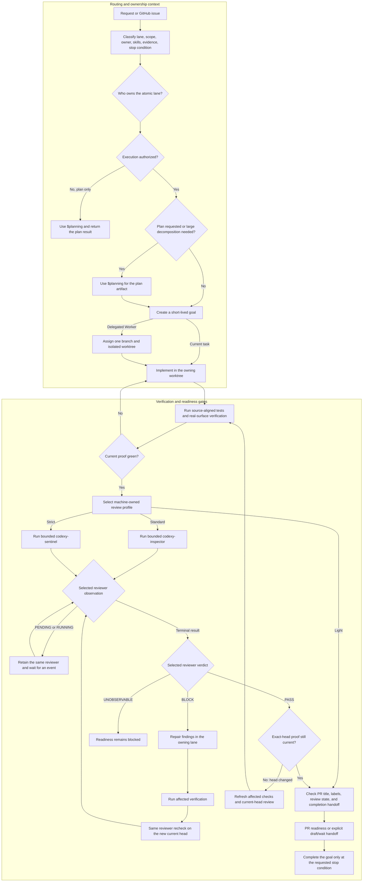

# Codexy plugin architecture

Codexy is a plugin-first harness for turning repository work into owned,
verifiable delivery lanes. This guide describes the components that ship in the
plugin and the workflow implemented by their current configuration. The source
of truth remains the packaged files linked below; being packaged or configured
does not by itself guarantee that a particular Codex host exposes the surface in
an already-running session.

The frozen target ownership for the future core, GitHub, and developer-tools
products is defined in the
[three-plugin product boundary](plugin-product-boundary.md).

## Specialist agents

The packaged catalog lists one TOML file per specialist. The plugin interface in
[`agents/openai.yaml`](../plugins/codexy/agents/openai.yaml) starts Codexy
itself; [`catalog.toml`](../plugins/codexy/agents/catalog.toml) and the
registration bootstrap discover and project the specialist files into Codex's
native location.

| Agent                 | Model           | Reasoning effort | Role                                                                                                                                                |
| --------------------- | --------------- | ---------------- | --------------------------------------------------------------------------------------------------------------------------------------------------- |
| `codexy-architect`    | `gpt-6-astra`   | `high`           | Defines conservative boundaries for plugin schemas, orchestration contracts, MCP/LSP wiring, validators, and durable extension points.              |
| `codexy-auditor`      | `gpt-5.6-terra` | `medium`         | Turns acceptance criteria into observable QA across configuration, documentation, CLI, GitHub, app, and plugin surfaces.                            |
| `codexy-cartographer` | `gpt-5.6-luna`  | `low`            | Performs fast, read-only repository discovery with codegraph, direct reads, file mapping, and ownership boundaries.                                 |
| `codexy-inspector`    | `gpt-5.6-sol`   | `medium`         | Performs the single bounded standard-profile review of current acceptance, changed files, and direct correctness, regression, and scope boundaries. |
| `codexy-sentinel`     | `gpt-6-astra`   | `xhigh`          | Runs the mandatory adversarial final review of scope, correctness, safety, tests, and current-head evidence.                                        |
| `codexy-shipwright`   | `gpt-5.6-terra` | `high`           | Prepares version, manifest, marketplace, artifact, tag, release, and rollback readiness.                                                            |
| `codexy-warden`       | `gpt-6-astra`   | `xhigh`          | Reviews workflows, shell commands, credentials, remote MCPs, untrusted input, permissions, and state mutation.                                      |

| `codexy-watcher` | `gpt-5.6-luna` | `max` | Performs bounded native read-only
Worker observation and reports material events through the core Watcher MCP. |

These model assignments come directly from the packaged TOMLs, which are
authoritative for a named custom agent's model and reasoning effort. Callers
should not silently override them.

The optional `codexy-github` plugin separately packages `codexy-weaver` for
GitHub integration after installation.

Removed-role rationale and the Inspector distinction are in
[`specialist-role-equivalence.md`](specialist-role-equivalence.md).

## Detailed boundaries

- [Skill boundaries and consumers](architecture/skill-boundaries.md)
- [Runtime boundaries and discovery](architecture/runtime-boundaries.md)

## Implemented orchestration

The main flow comes from `orchestration`, `git-workflow`, `engineering`, and
`proof-driven-completion`. Routing context selects the owner and execution lane;
verification and readiness checks are separate hard gates and cannot be replaced
by contextual hook messages.

The method is requirement-led. Acceptance criteria and material risks come
before issue-sized implementation, then the owner runs the relevant behavioral
checks and proves any claimed external surface on that surface. Executable
boundaries retain behavioral verification; test-first sequencing is separate:
reproducible defects require faithful RED before the fix, ordinary features and
behavior-preserving refactors may use optional ordering with the appropriate
baseline, and documentation or instruction prose uses structural proof instead
of manufactured RED. The
[engineering skill](../plugins/codexy/skills/engineering/SKILL.md) defines these
choices, while
[proof-driven completion](../plugins/codexy/skills/proof-driven-completion/SKILL.md)
audits the final current-state claim. Light, standard, and strict profiles
follow risk and surface. Reuse execution evidence per individual check, not as
whole-change readiness: after reading the current diff and the relevant
implementation, dependency or lock/configuration, fixtures, generated inputs,
and environment, a current applicability assessment may preserve a passed check
when its boundary and environment remain unchanged, including after unrelated
prose-only or other metadata-only changes. A relevant source, dependency,
lock/configuration, fixture, generated-input, or environment change, previous
failure, unresolved risk, or uncertain impact invalidates the affected evidence
and requires the check again. A reviewer PASS is always bound to its exact head;
an older PASS does not make a changed head current or allow affected checks to
be skipped.


```mermaid
flowchart TD
    subgraph routing["Routing and ownership context"]
        request["Request or GitHub issue"] --> classify["Classify lane, scope, owner, skills, evidence, stop condition"]
        classify --> owner{"Who owns the atomic lane?"}
        owner --> execution_gate{"Execution authorized?"}
        execution_gate -->|No, plan only| plan_only["Use $planning and return the plan result"]
        execution_gate -->|Yes| plan_gate{"Plan requested or large decomposition needed?"}
        plan_gate -->|Yes| plan["Use $planning for the plan artifact"]
        plan_gate -->|No| goal["Create a short-lived goal"]
        plan --> goal
        goal -->|Current task| implement["Implement in the owning worktree"]
        goal -->|Delegated Worker| worktree["Assign one branch and isolated worktree"]
        worktree --> implement
    end

    subgraph gates["Verification and readiness gates"]
        implement --> verify["Run source-aligned tests and real-surface verification"]
        verify --> proof{"Current proof green?"}
        proof -->|No| implement
        proof -->|Yes| profile["Select machine-owned review profile"]
        profile -->|Light| readiness["No LLM review"]
        profile -->|Standard| inspector["Run bounded codexy-inspector"]
        profile -->|Strict| sentinel["Run bounded codexy-sentinel"]
        inspector --> observation{"Selected reviewer observation"}
        sentinel --> observation
        observation -->|PENDING or RUNNING| wait_review["Retain the same reviewer and wait for an event"]
        wait_review --> observation
        observation -->|Terminal result| verdict{"Selected reviewer verdict"}
        verdict -->|BLOCK| repair["Repair findings in the owning lane"]
        repair --> affected["Run affected verification"]
        affected --> delta["Same reviewer recheck on the new current head"]
        delta --> observation
        verdict -->|UNOBSERVABLE| blocked["Readiness remains blocked"]
        verdict -->|PASS| head_gate{"Exact-head proof still current?"}
        head_gate -->|Yes| readiness["Check PR title, labels, review state, and completion handoff"]
        head_gate -->|No: head changed| refresh["Refresh affected checks and current-head review"]
        refresh --> verify
        readiness --> delivery["PR readiness or explicit draft/wait handoff"]
        delivery --> finish["Complete the goal only at the requested stop condition"]
    end
```

The owning lane keeps review-response fixes on the same branch. `PENDING` and
`RUNNING` retain the reviewer; `BLOCK` and `UNOBSERVABLE` keep readiness from
passing. Current-head identity, authenticated GitHub snapshots, ancestry, and
findings remain authoritative. A `PASS` supports readiness only when it has no
unresolved actionable findings and is bound to the exact current head. Missing
historical or optional connector evidence is unknown and does not add a gate.

## Keeping the guide current

The focused architecture inventory test reads packaged agent catalog/TOMLs,
skill frontmatter, and `.mcp.json`, compares them with the three tables, rejects
omitted or duplicate entries and stale agent model/reasoning values. Run:

```sh
cargo test --manifest-path packages/codexy-runtime/Cargo.toml --test suite_system architecture_docs_inventory
```

The plugin validator checks manifest, agents, skills, MCP, and LSP integrity:

```sh
scripts/validate-plugin-config.sh --check
```
