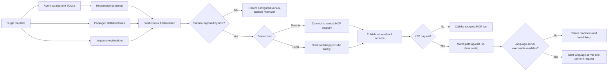

# Runtime boundaries and discovery

Return to the [architecture guide](../architecture.md).

## MCP servers

The optional Codexy Devtools manifest points `mcpServers` at
[`plugins/codexy-devtools/.mcp.json`](../../plugins/codexy-devtools/.mcp.json).
That file registers two plugin-local stdio servers; core Codexy registers its
required Watcher server in the corresponding core manifest. Registration tells a
host how to resolve a server; runtime startup and tool exposure still belong to
the host and the current session.

| Server      | Registration                                                                                                                | Runtime boundary                                                                                                                                                      | Capabilities and tools                                                                                                                                                                                                                                                                                                                  |
| ----------- | --------------------------------------------------------------------------------------------------------------------------- | --------------------------------------------------------------------------------------------------------------------------------------------------------------------- | --------------------------------------------------------------------------------------------------------------------------------------------------------------------------------------------------------------------------------------------------------------------------------------------------------------------------------------- |
| `codegraph` | `{"command":"uv","args":["run","--no-project","--script","./mcp/codexy_mcp_bootstrap.py","codegraph","--stdio"],"cwd":"."}` | The metadata-driven bootstrap reads the selected plugin release and starts the matching Codexy runtime as a local stdio child process.                                | `codegraph_overview`, `codegraph_search`, `codegraph_neighbors`, `codegraph_index`, `codegraph_reverse_deps`, and `codegraph_neighborhood` provide bounded repository maps and dependency-oriented discovery; `codegraph_change_impact` and `codegraph_check_selection` add read-only change impact and advisory check recommendations. |
| `lsp`       | `{"command":"uv","args":["run","--no-project","--script","./mcp/codexy_mcp_bootstrap.py","lsp","--stdio"],"cwd":"."}`       | The metadata-driven bootstrap reads the selected plugin release, then starts LSP against the packaged client config when its language-server executable is installed. | `lsp_list_servers`, `lsp_for_path`, `lsp_status`, `lsp_document_symbols`, `lsp_definition`, `lsp_references`, `lsp_diagnostics`, and `lsp_batch` cover discovery, readiness, language-aware requests, and bounded batches.                                                                                                              |
| `watcher`   | `{"command":"uv","args":["run","--no-project","--script","./mcp/codexy_mcp_bootstrap.py","watcher","--stdio"],"cwd":"."}`   | The metadata-driven bootstrap reads the selected plugin release and starts the required Watcher runtime as a local stdio child process.                               | `watcher_open`, `watcher_report`, `watcher_wait`, `watcher_health`, and `watcher_cancel` expose the required native Codex observation boundary.                                                                                                                                                                                         |

Codegraph's change tools are read-only adapters over Git change collection,
bounded Python/Rust impact analysis, and explicit check mappings. They return
limits, unknown areas, recommendation reasons, gaps, broader verification, and
manual judgment so incomplete evidence stays visible. Recommendations contain
command text as data; they do not execute checks, waive checks, or decide
completion. The installed-wrapper demonstrations cover documentation, a single
module, and a shared fixture. Those subprocess checks prove the packaged runtime
only; active host exposure remains unobserved until the host's callable tool
list and a real invocation are separately verified.

### Repository-only MCP scenario testing

The repository-only [`mcp-test`](../../.agents/skills/mcp-test/SKILL.md) skill
and [`run_scenario.py`](../../.agents/skills/mcp-test/scripts/run_scenario.py)
provide development tooling outside the installed Devtools package. The CLI runs
and compares explicit local stdio targets using the scenario format in
[`scenario-format.md`](../../.agents/skills/mcp-test/references/scenario-format.md):
ordered steps, selected stored fields, declared references, expectations, and
explicit target commands. Its support contract documents the trusted protocol
and platform boundary, including fail-closed behavior for unsupported versions
or platforms. Repository tests exercise a search-to-detail chain, a deliberate
comparison difference, and a linkage regression through a copied repository tool
bundle. These subprocess results prove repository-tool files and producer
provenance; they do not prove an active host's callable skill surface or an
app-level skill invocation.

### Selected batch-result application

The installed engineering workflow consumes a validated result from
[`batch_change_resume.py`](../../plugins/codexy/skills/engineering/scripts/batch_change_resume/batch_change_resume.py)
through
[`batch_change.py`](../../plugins/codexy/skills/engineering/scripts/batch_change.py)
and
[`batch-changes.md`](../../plugins/codexy/skills/engineering/references/batch-changes.md).
The user must select successful item IDs explicitly. The route presents a
readable diff, rechecks the original immediately before each independent
replacement, and reads back every applied file. It preserves failed, unselected,
and user-changed originals while distinguishing completed, conflict, and
incomplete items; repeating an application reports an already completed item
instead of replacing it again.

Application state is workspace-local and is not component inventory or journal
state. The workflow does not provide multi-file atomicity, protection from
arbitrary concurrent writers, process resurrection, scheduled wakeups, or
automatic commit/push of user changes.

For LSP,
[`lsp-client.json`](../../plugins/codexy-devtools/.codex/lsp-client.json) is the
machine-readable client registration and
[`server-catalog.toml`](../../plugins/codexy-devtools/lsp/server-catalog.toml)
carries the validated language, extension, command, and install-hint catalog. A
matching entry does not claim that the executable is installed.

### Configured versus callable

`codex plugin list` and `codex mcp list` can prove that Codex knows about a
plugin or server. They do not prove that an already-running host loaded the
registration, started the local binary or reached the remote endpoint, and
published every tool into the active callable surface. A fresh session may be
required after installation or update. When a registered server is missing from
the actual tool surface, Codexy treats that mismatch as evidence to record, not
as permission to claim the server worked.

### Runtime constraints

- `lsp_batch` accepts 1–8 requests that resolve to one server and workspace,
  with a shared deadline of at most 60,000 ms. Per-request timeouts are also
  capped at 60,000 ms; an unavailable language server returns readiness and
  install hints.
- Core hook timing is opt-in through `CODEXY_CORE_HOOK_TIMING_FILE`. When
  enabled, JSONL records contain only `event`, `concern`, `elapsed`, and
  `decision`, and the file is capped at 1 MiB. Timing failures never change hook
  policy.
- `getcodexy doctor` keeps `configured`, `loaded`, `callable`, and `verified`
  separate. A direct plugin-subprocess probe can establish the first three, but
  `verified` remains `unknown` without host/session evidence; `unknown` is
  non-proof for that observation and does not by itself classify overall health.
- Native Watcher observation uses one quiet `watcher_wait`: omitting `timeoutMs`
  selects the five-minute server-side default of 300,000 ms; the bounded
  `MAX_WAIT_MS` maximum remains 3,600,000 ms. An explicit shorter wait remains
  supported for a user deadline or a confirmed host limit. Same-connection
  `notifications/cancelled` releases only the pending request when the host
  propagates it and preserves the durable session; `watcher_cancel` separately
  ends that session and requires a fresh assignment.
- The core hook contract binds an authenticated Orchestrator `watcher_wait` in
  `PreToolUse` with an opaque `requestBinding`; the synchronous `Interrupt` hook
  writes a request-only cancellation marker consumed by the existing native 25
  ms wait check. Direct callers remain binding-free compatible, while a wrong
  turn/session, stale nonce, or durable `watcher_cancel` cannot release a
  different request.
- The source contract does not prove every host behavior. The verified host
  observation behind this contract showed that the one-hour request was bounded
  by an observed 300-second `tools/call` transport deadline; a host/task message
  or outer wait termination may leave the native wait active when the host does
  not propagate `Interrupt`. Candidate installation and actual host Stop proof
  remain separate acceptance evidence.

## Plugin and runtime discovery

This workflow separates configuration, installation, process startup, and
active-session exposure, including the point where LSP resolution can stop.

